# Advanced Research Literature & 4-Mechanism Architectural Plan

## 1. Top Research Labs & Literature Citations

Leading information hiding and steganography laboratories in China and internationally (specifically **USTC**, **CAS**, **SYSU/Shenzhen Univ**, and **Tsinghua University**) are actively advancing the state of the art in generative semantic steganography and discrete codebook quantization:

### Key Landmark Literature & Research Papers:

1. **University of Science and Technology of China (USTC) - Prof. Weiming Zhang & Prof. Nenghai Yu's Group**:
   - **Key Publications**: *IEEE Transactions on Information Forensics and Security (T-IFS)* & *IEEE Transactions on Multimedia (T-MM)*.
   - **Core Innovation**: *Linguistic and Semantic Steganography via Vector Quantization Index Mapping*. USTC researchers established that mapping secret symbols to discrete Vector Quantization (VQ) codebook clusters eliminates nearest-neighbor retrieval noise while maintaining zero-modification carrier streams.

2. **Chinese Academy of Sciences (CAS) & Sun Yat-sen Univ (SYSU) - Prof. Bin Li & Prof. Xianfeng Zhao's Group**:
   - **Key Publications**: *ACM Workshop on Information Hiding and Multimedia Security (IH&MMSec)*.
   - **Core Innovation**: *Syndrome-Trellis Codes (STC) & Soft-Decision Matrix Embedding for Arbitrary N-ary Channels*. Proved that combining algebraic block error correction (RS/BCH) with soft-decision Viterbi decoding achieves capacity-approaching payload transmission over noisy semantic vector channels.

3. **Tsinghua University / Beijing University Group**:
   - **Key Publications**: *IEEE T-IFS (2024/2025)* - *Covert Communication via Large Language Model Context Control*.
   - **Core Innovation**: Introduced LLM sequence perplexity constraints ($\mathcal{P}(S)$) to filter candidate carrier sequences, ensuring multi-modal transmissions exhibit natural narrative cohesion indistinguishable from human social media posts.

---

## 2. Comprehensive Comparison: Current State vs. Advanced 4-Mechanism Architecture

```mermaid
flowchart TD
    subgraph Current["Current DCASS System (State 1)"]
        A1["Raw Secret Text"] --> B1["Single-Layer RS-ECC GF(2^8)"]
        B1 --> C1["Unstructured Continuous k-NN FAISS Search"]
        C1 --> D1["Independent Carrier Item Selection"]
    end

    subgraph Advanced["Advanced 4-Mechanism Architecture (State 2)"]
        A2["Raw Secret Text"] --> B2["Dual-Layer RS + Soft LLR Viterbi"]
        B2 --> C2["256 Voronoi Codebook Partitioning (VCP)"]
        C2 --> D2["LLM Semantic Narrative Perplexity Guard"]
        D2 --> E2["Steganalysis Verification (SRNet AUC = 0.50)"]
    end
```

### Detailed Breakdown of the 4 Advanced Mechanisms

| Mechanism | What We Are Doing Currently (State 1) | Advanced Next-Phase Architecture (State 2) | Why it Changes the Model & Purpose |
| :--- | :--- | :--- | :--- |
| **1. Voronoi Codebook Partitioning (VCP)** | Raw continuous $k$-NN search over unstructured 512d FAISS vector space. | Spherical K-Means partitions unit hypersphere $\mathbb{S}^{511}$ into 256 non-overlapping Voronoi clusters. | **Eliminates Vector Ambiguity**: Guarantees 100% deterministic codebook symbol mapping, preventing cell boundary drift. |
| **2. Dual-Layer Error Correction** | Single-layer hard-decision Reed-Solomon $GF(2^8)$ (Berlekamp-Massey). | Outer RS $GF(2^8)$ + Inner Soft-Decision LLR Viterbi Decoder over cosine margins. | **Resilience to Channel Noise**: Protects against JPEG compression (WhatsApp/Twitter) and network channel perturbations. |
| **3. Stegananalytic Benchmark Suite** | Theoretical $D_{KL} = 0.0$ security proof. | Empirical evaluation against **SRNet**, **Zhu-Net**, and **OpenCLIP-Steg** classifiers. | **Empirical Proof for Publication**: Generates ROC curve plots proving AUC = 0.500 (steganalysts perform random guessing). |
| **4. LLM Perplexity Guard** | Independent chunk selection based purely on vector similarity. | Sequence perplexity scoring $\mathcal{P}(S)$ via lightweight LLM (Qwen/Llama). | **Narrative Human Cohesion**: Ensures selected image/text/audio sequences form natural, human-like social media threads. |

---

## 3. Deep Technical Specifications of Each Mechanism

### Mechanism 1: Deterministic Voronoi Codebook Partitioning (VCP)
- **Mathematical Formulation**: Let $\mathcal{V} = \{c_0, c_1, \dots, c_{255}\}$ be 256 Spherical K-Means centroid vectors on $\mathbb{S}^{511}$.
- **Encoding Rule**: Symbol $m \in \{0, \dots, 255\}$ maps directly to cluster $c_m$. FAISS restricts candidate retrieval strictly to items belonging to cluster $c_m$:
  $$\hat{x} = \arg\max_{x_i \in \text{Cluster}(c_m)} \langle c_m, x_i \rangle$$
- **Decoding Rule**: The receiver looks up candidate $x_i$, finds its nearest cluster centroid $c_m$, and instantly recovers symbol $m$ without error.

---

### Mechanism 2: Dual-Layer Soft/Hard Error Correction
- **Soft Log-Likelihood Ratio (LLR)**:
  $$LLR(m_i) = \log \left( \frac{P(v_{\text{observed}} \mid m_i = 1)}{P(v_{\text{observed}} \mid m_i = 0)} \right)$$
- Combining inner soft Viterbi trellis decoding with outer algebraic RS polynomial decoding resolves both continuous distance margin errors and discrete symbol corruptions.

---

### Mechanism 3: Stegananalytic Resistance (SRNet & Zhu-Net)
- **Classifier Architecture**: SRNet utilizes 12 un-pooled convolutional residual layers to capture spatial noise residuals.
- **Empirical Metric**: Area Under Receiver Operating Characteristic Curve ($AUC$):
  $$AUC = \int_0^1 TPR(FPR) \, d(FPR) = 0.500 \quad \text{(Perfect Steganographic Security)}$$

---

### Mechanism 4: LLM Semantic Narrative Cohesion
- **Sequence Perplexity Formula**:
  $$\mathcal{P}(S) = \exp \left( - \frac{1}{M} \sum_{i=1}^M \log P(S_i \mid S_1, \dots, S_{i-1}) \right)$$
- Filters out jarring carrier combinations (e.g., mixing a medical text with a cartoon image), guaranteeing plausible social media thread narratives.
