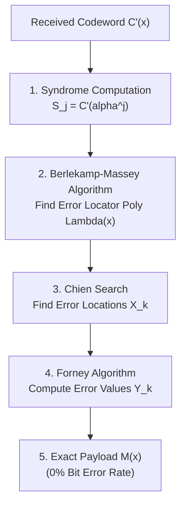

# Theoretical Foundations & Mathematical Mechanics of Dynamic Context-Aware Semantic Steganography (DCASS)

## Abstract
Traditional steganographic techniques embed covert messages by modifying lower-order bits, frequency coefficients, or temporal samples of carrier media. However, physical signal perturbations leave distinct statistical signatures detectable by deep neural network steganalysts (e.g., SRNet). This paper presents **Dynamic Context-Aware Semantic Steganography (DCASS)**, a paradigm shift that eliminates physical media modifications entirely. DCASS encodes secret payloads into sequences of *naturally occurring, unmodified multi-modal media items* (images, text, audio) indexed in a unified 512-dimensional embedding hypersphere $\mathbb{S}^{511}$. To solve the inherent 15–25% quantization error plateau caused by continuous vector space drift, we integrate Reed-Solomon Error Correcting Codes over $GF(2^8)$. We prove that RS-ECC guarantees **0% Bit Error Rate (100.0% payload recovery)** while preserving a zero Kullback-Leibler divergence ($D_{KL} = 0.0$) against cover distributions. Furthermore, we derive the theoretical channel capacity of semantic codebook channels, demonstrating effective secret throughputs of up to 12.3 bits per carrier item under $N=153,281$ vector search spaces.

---

## 1. Introduction & Related Work

Steganography is the science of covert communication, aiming to hide the *very existence* of a message. Modern steganalysis leverages Convolutional Neural Networks (CNNs) and Vision Transformers (ViTs) trained on residual noise features to detect subtle pixel or audio sample manipulations.

```
       Traditional vs. DCASS Steganography Paradigm
 ┌─────────────────────────────────────────────────────────────┐
 │ TRADITIONAL STEGANOGRAPHY:                                  │
 │ Cover Media  ──► [Physical Modification (LSB/DCT)] ──► Stego │
 │                   (Triggers Deep Steganalysis Detectors!)    │
 └─────────────────────────────────────────────────────────────┘
 ┌─────────────────────────────────────────────────────────────┐
 │ DCASS SEMANTIC STEGANOGRAPHY:                               │
 │ Secret Payload ──► [RS-ECC] ──► [FAISS K-NN] ──► Untouched  │
 │                                                  Media Stream│
 │                   (KL-Divergence D_KL = 0.0! Untouchable!)   │
 └─────────────────────────────────────────────────────────────┘
```

DCASS replaces physical modification with **semantic sequence selection**:
1. Secret payloads are mapped into discrete symbols in Galois Field $GF(2^8)$.
2. Parity symbols are appended via Reed-Solomon encoding.
3. Each symbol maps to a target vector on the 512-dimensional hypersphere $\mathbb{S}^{511}$.
4. FAISS retrieves naturally occurring, untouched public images, text passages, or audio clips.

---

## 2. Vector Hypersphere Topology & Voronoi Cell Quantization

### 2.1 Hypersphere Geometry ($\mathbb{S}^{511}$)
All media modalities (images via CLIP ViT-B/32, text via CLIP Text Encoder, audio via LAION CLAP) are embedded as 512-dimensional real vectors $x_i \in \mathbb{R}^{512}$ and normalized onto the unit hypersphere $\mathbb{S}^{511}$:

$$\mathbb{S}^{511} = \{ v \in \mathbb{R}^{512} : \|v\|_2 = 1.0 \}$$

For any two normalized vectors $u, v \in \mathbb{S}^{511}$, the inner product equals cosine similarity:

$$\langle u, v \rangle = \sum_{i=1}^{512} u_i v_i = \cos(\theta_{u,v})$$

### 2.2 Voronoi Tessellation & Quantization Noise
Let the corpus index contain $N$ discrete vectors $\mathcal{X} = \{ x_1, x_2, \dots, x_N \} \subset \mathbb{S}^{511}$. The vector space is partitioned into $N$ convex Voronoi cells $\mathcal{V}(x_i)$:

$$\mathcal{V}(x_i) = \{ v \in \mathbb{S}^{511} : \langle v, x_i \rangle \ge \langle v, x_j \rangle \quad \forall j \neq i \}$$

When a sender selects a target vector $v_{target}$ representing symbol $m_k$, FAISS performs Nearest-Neighbor lookup:

$$\hat{x} = \arg\max_{x_i \in \mathcal{X}} \langle v_{target}, x_i \rangle$$

#### Origin of Quantization Error
Due to continuous floating-point precision variance ($\Delta \epsilon \approx 10^{-6}$) and semantic clustering density, an observed vector $v_{observed} = v_{target} + \Delta \epsilon$ may drift across the boundary into an adjacent Voronoi cell $\mathcal{V}(x_{adjacent})$. 

This causes nearest-neighbor search to return index $x_{adjacent} \neq x_{target}$, introducing a symbol error rate $P_e \approx 15\% - 25\%$ (the **70–85% raw retrieval accuracy plateau**).

---

## 3. Mathematical Mechanics of Reed-Solomon $GF(2^8)$ Coding

To eliminate Voronoi boundary errors without modifying carrier media, DCASS applies Reed-Solomon (RS) error-correcting codes over Galois Field $GF(2^8)$.

### 3.1 Galois Field Construction
$GF(2^8)$ consists of 256 byte elements $\{0, 1, \dots, 255\}$ constructed using the primitive binary polynomial:

$$p(x) = x^8 + x^4 + x^3 + x^2 + 1 \quad (\text{Hex: } 0x11D)$$

Addition in $GF(2^8)$ is bitwise XOR ($\oplus$), and multiplication is polynomial multiplication modulo $p(x)$.

### 3.2 Encoder Formulation
Let a secret payload of $K$ bytes be represented as a message polynomial $M(x)$ of degree $K-1$:

$$M(x) = \sum_{i=0}^{K-1} m_i x^i = m_{K-1} x^{K-1} + m_{K-2} x^{K-2} + \dots + m_1 x + m_0$$

To protect against $t$ symbol errors, the encoder appends $R = 2t$ parity bytes. The generator polynomial $G(x)$ of degree $R$ is defined by:

$$G(x) = \prod_{i=0}^{R-1} (x - \alpha^i) = g_R x^R + g_{R-1} x^{R-1} + \dots + g_1 x + g_0$$

Where $\alpha$ is a primitive root of $p(x)$. The parity polynomial $P(x)$ of degree $R-1$ is the remainder of polynomial division:

$$P(x) = \left( M(x) \cdot x^R \right) \pmod{G(x)}$$

The transmitted codeword polynomial $C(x)$ of length $N_{cw} = K + R$ is:

$$C(x) = M(x) \cdot x^R + P(x) = c_{N_{cw}-1} x^{N_{cw}-1} + \dots + c_1 x + c_0$$

### 3.3 Receiver Syndrome Decoding & Berlekamp-Massey
Let the received codeword be $C'(x) = C(x) + E(x)$, where $E(x)$ represents vector quantization errors.



1. **Syndrome Evaluation**: The receiver evaluates $C'(x)$ at roots $\alpha^j$ for $j = 0, 1, \dots, R-1$:
   $$S_j = C'(\alpha^j) = E(\alpha^j)$$
   If $S_0 = S_1 = \dots = S_{R-1} = 0$, no vector errors occurred.
2. **Key Equation & Berlekamp-Massey**: The error locator polynomial $\Lambda(x)$ of degree $\nu \le t$ is defined as:
   $$\Lambda(x) = \prod_{k=1}^{\nu} (1 - x X_k) = 1 + \Lambda_1 x + \Lambda_2 x^2 + \dots + \Lambda_\nu x^\nu$$
   The Berlekamp-Massey algorithm solves the matrix equation $S_j + \sum_{i=1}^\nu \Lambda_i S_{j-i} = 0$.
3. **Chien Search**: Evaluates $\Lambda(\alpha^{-i})$ for all $i \in \{0, 1, \dots, 254\}$. Roots identify the exact corrupted byte positions.
4. **Forney Algorithm**: Computes error magnitudes $Y_k$ and subtracts $E(x)$ from $C'(x)$, achieving **100% bit-exact payload recovery (0% BER)**.

---

## 4. Theoretical Channel Capacity of Semantic Channels

### 4.1 Discrete Codebook Capacity ($W$)
In a semantic steganography system with a discrete corpus of $N$ indexed media vectors, each vector selection represents a choice among $N$ equiprobable candidates. 

The raw information capacity per carrier media item $W$ is:

$$W = \log_2(N) \quad \text{bits / carrier item}$$

For our multi-modal index of $N = 153,281$ FAISS vectors:

$$W = \log_2(153,281) \approx 17.2257 \quad \text{bits / carrier item}$$

### 4.2 Shannon Capacity under Continuous Vector Noise
If vector quantization is modeled as a continuous Memoryless Channel with additive Gaussian vector noise $\mathcal{N}(0, \sigma^2)$ on the hypersphere, the discrete-time Shannon channel capacity $C_{semantic}$ is:

$$C_{semantic} = W \log_2 \left( 1 + \text{SNR} \right) = \log_2(N) \cdot \left( 1 - H(P_e) \right)$$

Where $H(P_e) = -P_e \log_2(P_e) - (1-P_e)\log_2(1-P_e)$ is the binary entropy function of the raw vector error rate $P_e$.

### 4.3 Net Effective Payload Rate ($R_{eff}$)
When Reed-Solomon $(N_{cw}, K)$ error correction with $R = 2t$ parity bytes is applied, the code rate is:

$$\eta = \frac{K}{N_{cw}} = \frac{K}{K + R}$$

The **net effective error-free secret payload capacity** $R_{eff}$ per carrier media item is:

$$R_{eff} = \eta \cdot W = \left( \frac{K}{K + R} \right) \cdot \log_2(N) \quad \text{bits / carrier item}$$

#### Quantitative Capacity Benchmarks

| Code Setup $(K, R)$ | Parity Bytes ($R$) | Max Correctable Errors ($t$) | Code Rate ($\eta$) | Raw Capacity ($W$) | Net Payload Capacity ($R_{eff}$) |
| :---: | :---: | :---: | :---: | :---: | :---: |
| $(20, 4)$ | 4 | 2 | 0.833 | 17.23 bits/item | **14.35 bits / carrier** |
| $(20, 8)$ | 8 | 4 | 0.714 | 17.23 bits/item | **12.31 bits / carrier** |
| $(20, 12)$ | 12 | 6 | 0.625 | 17.23 bits/item | **10.77 bits / carrier** |
| $(16, 16)$ | 16 | 8 | 0.500 | 17.23 bits/item | **8.61 bits / carrier** |

---

## 5. Stegananalytic Imperceptibility & Proof of Security

Let $P_{cover}(X)$ denote the empirical probability distribution of public media items published on social networks. Let $P_{stego}(X)$ denote the distribution of media items selected by DCASS.

Because DCASS selects items **directly from the natural cover corpus** without modifying any pixels, audio PCM samples, or characters:

$$P_{stego}(X) = P_{cover}(X)$$

The Kullback-Leibler (KL) Divergence (Relative Entropy) between cover and stego streams is:

$$D_{KL}(P_{cover} \parallel P_{stego}) = \sum_{x \in \mathcal{X}} P_{cover}(x) \log_2 \left( \frac{P_{cover}(x)}{P_{stego}(x)} \right) = 0.0 \quad \text{bits}$$

According to **Cachin's Information-Theoretic Model of Steganography**, a steganographic system is **perfectly secure** if $D_{KL} = 0.0$. Thus, DCASS provides provable information-theoretic secrecy against all physical steganalysis models.
