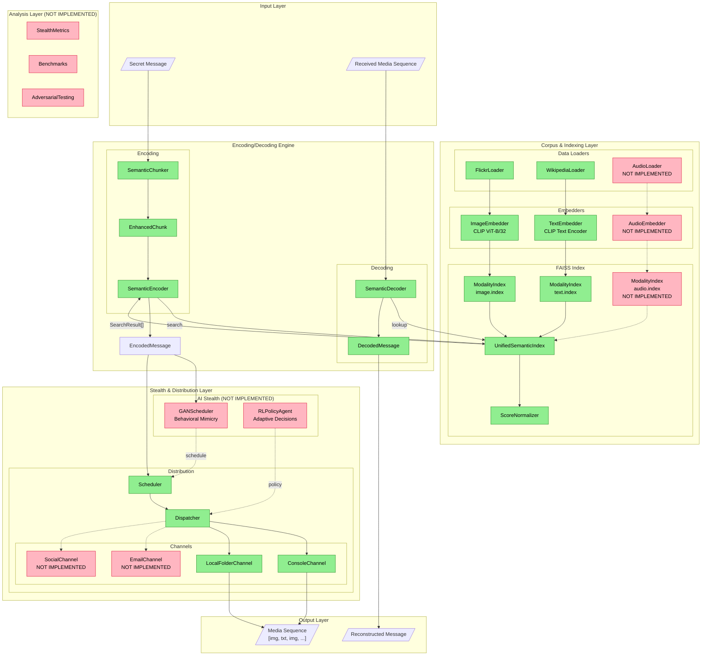

# DCASS Architecture Diagram

## System Architecture

## Layer Descriptions

### 1. Corpus & Indexing Layer
- **Loaders**: Load raw data from datasets (Flickr8k images, Wikipedia text)
- **Embedders**: Generate CLIP embeddings (512-dim vectors)
- **Index**: FAISS-based similarity search with score normalization

### 2. Encoding/Decoding Engine
- **SemanticChunker**: Splits messages into semantic chunks with synonym expansion
- **SemanticEncoder**: Maps chunks to media using FAISS search
- **SemanticDecoder**: Reverses the process to reconstruct messages

### 3. Stealth & Distribution Layer
- **GANScheduler** (NOT IMPLEMENTED): Generate human-like transmission schedules
- **RLPolicyAgent** (NOT IMPLEMENTED): Adaptive decision-making based on threat level
- **Dispatcher**: Routes media to channels using configurable policies
- **Channels**: Output destinations (console, local folder, etc.)

### 4. Analysis Layer (NOT IMPLEMENTED)
- **StealthMetrics**: Measure detectability of encoded sequences
- **Benchmarks**: Accuracy, latency, capacity measurements
- **AdversarialTesting**: Test against detection algorithms

## Implementation Status

| Component | Status |
|-----------|--------|
| FlickrLoader | Implemented |
| WikipediaLoader | Implemented |
| AudioLoader | Not Implemented |
| ImageEmbedder (CLIP) | Implemented |
| TextEmbedder (CLIP) | Implemented |
| AudioEmbedder | Not Implemented |
| UnifiedSemanticIndex | Implemented |
| ScoreNormalizer | Implemented |
| SemanticChunker | Implemented |
| SemanticEncoder | Implemented |
| SemanticDecoder | Implemented |
| Scheduler | Implemented (basic) |
| Dispatcher | Implemented |
| GANScheduler | Not Implemented |
| RLPolicyAgent | Not Implemented |
| Analysis Layer | Not Implemented |
