# DCASS Class Diagram

## Master Class Diagram

```mermaid
classDiagram
    direction TB

    %% ==================== ENGINE LAYER ====================
    class SemanticEncoder {
        -UnifiedSemanticIndex index
        -SemanticChunker chunker
        -Modality default_modality
        -bool _loaded
        +load(modalities: List~str~) void
        +encode(message: str, modality: Modality, k_candidates: int) EncodedMessage
        +encode_hierarchical(message: str, modality: Modality) EncodedMessage
        +encode_batch(messages: List~str~) List~EncodedMessage~
        +get_statistics(encoded: EncodedMessage) Dict
        -_apply_diversity(candidates: List, used_ids: set, penalty: float) List
    }

    class SemanticDecoder {
        -UnifiedSemanticIndex index
        -str default_modality
        -bool _loaded
        -Dict _metadata_lookup
        +load(modalities: List~str~) void
        +decode(media_sequence: List~str~, modality: str) DecodedMessage
        +decode_from_encoded(encoded_path: Path) DecodedMessage
        +verify_encoding(encoded_path: Path) Dict
        -_build_metadata_lookup() void
        -_decode_single(media_ref: str, modality: str) tuple
        -_simple_similarity(text1: str, text2: str) float
    }

    class SemanticChunker {
        -str strategy
        -int min_chunk_length
        -int max_chunk_length
        -bool expand_synonyms
        -bool decompose_concepts
        -bool hierarchical
        -int max_synonyms
        -int max_concrete
        +chunk(text: str) List~str~
        +chunk_enhanced(text: str) List~EnhancedChunk~
        +get_all_variants(text: str) List~List~str~~
        -_normalize(text: str) str
        -_chunk_sentences(text: str) List~str~
        -_chunk_clauses(text: str) List~str~
        -_chunk_phrases(text: str) List~str~
        -_filter_chunks(chunks: List) List
        -_expand_synonyms(chunk: str) List~str~
        -_decompose_abstract(chunk: str) List~str~
        -_create_sub_chunks(chunk: str) List~str~
    }

    class EncodedMessage {
        +str original_message
        +List~str~ chunks
        +List~SearchResult~ sequence
        +str modality_used
        +Dict metadata
        +media_ids() List~str~
        +media_paths() List~str~
        +modality_sequence() List~str~
        +modality_distribution() Dict~str,int~
        +is_mixed_modality() bool
        +to_dict() Dict
        +to_json(indent: int) str
        +save(path: Path) void
        +from_dict(data: Dict) EncodedMessage
        +load(path: Path) EncodedMessage
    }

    class DecodedMessage {
        +List~str~ media_sequence
        +List~str~ semantic_chunks
        +str reconstructed_text
        +List~float~ confidence_scores
        +Dict metadata
        +avg_confidence() float
        +to_dict() Dict
        +to_json(indent: int) str
    }

    class EnhancedChunk {
        +str original
        +str normalized
        +List~str~ synonyms
        +List~str~ concrete_forms
        +List~str~ sub_chunks
        +all_variants() List~str~
    }

    %% ==================== CORPUS/INDEX LAYER ====================
    class UnifiedSemanticIndex {
        -Config config
        -Dict~str,ModalityIndex~ _indices
        -ImageEmbedder _clip_embedder
        -bool normalize_scores
        -ScoreNormalizer _normalizer
        +load(modalities: List~str~) void
        +search(query: str, modality: str, k: int) List~SearchResult~
        +search_all_modalities(query: str, k: int) Dict~str,List~
        +encode_message(message: str, modality: str) List~SearchResult~
        +get_index(modality: str) ModalityIndex
        +available_modalities() List~str~
        +loaded_modalities() List~str~
        +status() Dict
        -_init_indices() void
        -_get_clip_embedder() ImageEmbedder
    }

    class ModalityIndex {
        +str modality
        +Path index_path
        +Path metadata_path
        -faiss.Index index
        +List~Dict~ metadata
        +build(embeddings: ndarray, metadata: List) void
        +save() void
        +load() void
        +search(query_embedding: ndarray, k: int) List~SearchResult~
        +size() int
        +exists() bool
    }

    class ScoreNormalizer {
        +str method
        +Dict calibration
        +float image_boost
        +float diversity_ratio
        +normalize(results: List, modality: str) List~SearchResult~
        +normalize_cross_modal(results_by_modality: Dict, k: int) List~SearchResult~
        -_apply_diversity(results: List, k: int) List
    }

    class SearchResult {
        +str id
        +float score
        +str modality
        +str content
        +Dict metadata
    }

    %% ==================== EMBEDDERS LAYER ====================
    class BaseEmbedder {
        <<abstract>>
        +str model_name
        +str device
        +encode(inputs: List~str~)* ndarray
        +dimension()* int
    }

    class ImageEmbedder {
        +str model_name
        +str device
        -CLIPModel model
        -CLIPProcessor preprocess
        +encode(inputs: List~Path~) ndarray
        +encode_text(texts: List~str~) ndarray
        +dimension() int
    }

    class TextEmbedder {
        +str model_name
        +str device
        -CLIPModel model
        +encode(inputs: List~str~) ndarray
        +dimension() int
    }

    %% ==================== LOADERS LAYER ====================
    class BaseLoader {
        <<abstract>>
        +Path data_dir
        +load()* Generator
        +count()* int
    }

    class FlickrLoader {
        +Path data_dir
        +Path images_dir
        +Path captions_file
        +load() Generator~Dict~
        +load_images() Generator~Dict~
        +load_captions() Dict~str,List~str~~
        +count() int
    }

    class WikipediaLoader {
        +Path data_dir
        +Path sentences_file
        +int max_sentences
        +load() Generator~Dict~
        +count() int
    }

    %% ==================== DISTRIBUTION LAYER ====================
    class Dispatcher {
        +Dict~str,BaseChannel~ channels
        +str policy
        -List~str~ _channel_names
        +dispatch(image_sequence: List~str~) List~dict~
        +dispatch_one(image_id: str, index: int) dict
        -_select_channel(index: int) BaseChannel
    }

    class Scheduler {
        +Dispatcher dispatcher
        +List~int~ delays
        +run(image_sequence: List~str~) List~dict~
    }

    class BaseChannel {
        <<abstract>>
        +str name
        +send(image_id: str, metadata: dict)* dict
        #_base_log(image_id: str) dict
    }

    class ConsoleChannel {
        +str name
        +send(image_id: str, metadata: dict) dict
    }

    class LocalFolderChannel {
        +str name
        +Path output_dir
        +send(image_id: str, metadata: dict) dict
    }

    %% ==================== STEALTH LAYER====================
    class GANScheduler {
        
        -Generator generator
        -Discriminator discriminator
        +generate_schedule(sequence_length: int) List~float~
        +train(human_schedules: List) void
    }

    class RLPolicyAgent {
        
        -PolicyNetwork policy
        -StateMonitor state_monitor
        +select_action(state: State) Action
        +update_policy(reward: float) void
        +get_threat_level() float
    }

    %% ==================== RELATIONSHIPS ====================
    
    %% Engine relationships
    SemanticEncoder --> UnifiedSemanticIndex : uses
    SemanticEncoder --> SemanticChunker : uses
    SemanticEncoder --> EncodedMessage : creates
    SemanticEncoder --> EnhancedChunk : uses
    
    SemanticDecoder --> UnifiedSemanticIndex : uses
    SemanticDecoder --> DecodedMessage : creates
    
    SemanticChunker --> EnhancedChunk : creates
    
    EncodedMessage --> SearchResult : contains
    
    %% Index relationships
    UnifiedSemanticIndex --> ModalityIndex : manages
    UnifiedSemanticIndex --> ScoreNormalizer : uses
    UnifiedSemanticIndex --> ImageEmbedder : uses
    
    ModalityIndex --> SearchResult : returns
    ScoreNormalizer --> SearchResult : normalizes
    
    %% Embedder relationships
    ImageEmbedder --|> BaseEmbedder : extends
    TextEmbedder --|> BaseEmbedder : extends
    
    %% Loader relationships
    FlickrLoader --|> BaseLoader : extends
    WikipediaLoader --|> BaseLoader : extends
    
    %% Distribution relationships
    Scheduler --> Dispatcher : uses
    Dispatcher --> BaseChannel : routes to
    ConsoleChannel --|> BaseChannel : extends
    LocalFolderChannel --|> BaseChannel : extends
    
    %% Stealth relationships (planned)
    GANScheduler ..> Scheduler : would replace
    RLPolicyAgent ..> Dispatcher : would advise

    %% Styling
    style GANScheduler fill:#FFB6C1,stroke:#DC143C
    style RLPolicyAgent fill:#FFB6C1,stroke:#DC143C
```

## Class Descriptions

### Engine Layer

| Class | Description | Status |
|-------|-------------|--------|
| `SemanticEncoder` | Main encoder - maps messages to media sequences | Implemented |
| `SemanticDecoder` | Reverses encoding to reconstruct messages | Implemented |
| `SemanticChunker` | Splits text into semantic chunks with expansions | Implemented |
| `EncodedMessage` | Data class for encoded message output | Implemented |
| `DecodedMessage` | Data class for decoded message output | Implemented |
| `EnhancedChunk` | Data class for chunk with synonyms/variants | Implemented |

### Corpus/Index Layer

| Class | Description | Status |
|-------|-------------|--------|
| `UnifiedSemanticIndex` | Central index manager for all modalities | Implemented |
| `ModalityIndex` | FAISS index wrapper for single modality | Implemented |
| `ScoreNormalizer` | Normalizes scores across modalities | Implemented |
| `SearchResult` | Data class for search results | Implemented |

### Embedders Layer

| Class | Description | Status |
|-------|-------------|--------|
| `BaseEmbedder` | Abstract base for all embedders | Implemented |
| `ImageEmbedder` | CLIP-based image/text embedder | Implemented |
| `TextEmbedder` | CLIP text encoder wrapper | Implemented |
| `AudioEmbedder` | CLAP-based audio embedder 

### Loaders Layer

| Class | Description | Status |
|-------|-------------|--------|
| `BaseLoader` | Abstract base for data loaders | Implemented |
| `FlickrLoader` | Loads Flickr8k images and captions | Implemented |
| `WikipediaLoader` | Loads Wikipedia sentences | Implemented |

### Distribution Layer

| Class | Description | Status |
|-------|-------------|--------|
| `Dispatcher` | Routes media to channels by policy | Implemented |
| `Scheduler` | Manages timing of dispatches | Implemented (basic) |
| `BaseChannel` | Abstract base for output channels | Implemented |
| `ConsoleChannel` | Outputs to console | Implemented |
| `LocalFolderChannel` | Outputs to local folder | Implemented |

### Stealth Layer (Planned)

| Class | Description | Status |
|-------|-------------|--------|
| `GANScheduler` | GAN-based human behavior mimicry 
| `RLPolicyAgent` | RL-based adaptive policy agent 
