# DCASS Entity-Relationship Diagram

## Data Entities and Relationships

```mermaid
erDiagram
    %% ==================== MEDIA ENTITIES ====================
    IMAGE {
        string id PK "e.g., flickr8k_001"
        string file_path "path to image file"
        string caption "associated caption"
        float[] embedding "512-dim CLIP vector"
        datetime indexed_at
    }
    
    TEXT {
        string id PK "e.g., wiki_00001"
        string content "text content"
        string source "wikipedia, flickr, etc"
        float[] embedding "512-dim CLIP vector"
        datetime indexed_at
    }
    
    AUDIO {
        string id PK "e.g., audio_001"
        string file_path "path to audio file"
        string transcript "optional transcript"
        float[] embedding "512-dim CLAP vector"
        datetime indexed_at
    }

    %% ==================== INDEX ENTITIES ====================
    FAISS_INDEX {
        string modality PK "text, image, audio"
        string index_path "path to .index file"
        int dimension "512 for CLIP"
        int num_vectors "total indexed items"
        datetime built_at
    }
    
    INDEX_METADATA {
        string id PK
        string modality FK
        string content "text or file path"
        json extra_metadata "captions, sources, etc"
    }

    %% ==================== ENCODING ENTITIES ====================
    ENCODED_MESSAGE {
        string id PK "hash of original message"
        string original_message "the secret message"
        json chunks "list of semantic chunks"
        string modality_used "auto, text, image"
        json metadata "encoding params"
        datetime created_at
    }
    
    MEDIA_SEQUENCE {
        string encoded_message_id FK
        int sequence_order
        string media_id FK "id of selected media"
        string modality "text or image"
        float score "similarity score"
        string matched_query "query that matched"
    }
    
    ENHANCED_CHUNK {
        string id PK
        string original "original chunk text"
        string normalized "normalized form"
        json synonyms "list of synonyms"
        json concrete_forms "concrete decompositions"
    }

    %% ==================== DISTRIBUTION ENTITIES ====================
    DISPATCH_LOG {
        string id PK
        string encoded_message_id FK
        string media_id FK
        string channel_name "console, folder, etc"
        datetime dispatched_at
        float delay_seconds "time waited before send"
        json metadata
    }
    
    CHANNEL_CONFIG {
        string name PK "channel identifier"
        string type "console, local_folder, email"
        json config "channel-specific settings"
        bool enabled
    }
    
    SCHEDULE {
        string id PK
        string encoded_message_id FK
        json delays "list of delay times"
        string generation_method "manual, gan, rl"
        datetime created_at
    }

    %% ==================== STEALTH ENTITIES (PLANNED) ====================
    GAN_MODEL {
        string id PK
        string version
        blob generator_weights "Generator network"
        blob discriminator_weights "Discriminator network"
        float training_loss
        datetime trained_at
    }
    
    RL_POLICY {
        string id PK
        string version
        blob policy_weights "Policy network weights"
        float avg_reward
        int training_steps
        datetime trained_at
    }
    
    THREAT_STATE {
        string id PK
        datetime timestamp
        float threat_level "0.0 to 1.0"
        json observations "network conditions, etc"
        string action_taken
    }

    %% ==================== ANALYSIS ENTITIES (PLANNED) ====================
    BENCHMARK_RESULT {
        string id PK
        string benchmark_type "accuracy, latency, capacity"
        string test_name
        float result_value
        json parameters
        datetime run_at
    }
    
    STEALTH_METRIC {
        string id PK
        string encoded_message_id FK
        string metric_type "entropy, distribution, etc"
        float value
        datetime calculated_at
    }
    
    ADVERSARIAL_TEST {
        string id PK
        string test_type "traffic_analysis, statistical"
        string encoded_message_id FK
        bool detected "was it detected?"
        float confidence "detection confidence"
        json details
        datetime tested_at
    }

    %% ==================== RELATIONSHIPS ====================
    
    %% Media to Index
    IMAGE ||--o{ INDEX_METADATA : "indexed as"
    TEXT ||--o{ INDEX_METADATA : "indexed as"
    AUDIO ||--o{ INDEX_METADATA : "indexed as"
    FAISS_INDEX ||--o{ INDEX_METADATA : "contains"
    
    %% Encoding relationships
    ENCODED_MESSAGE ||--o{ MEDIA_SEQUENCE : "contains"
    ENCODED_MESSAGE ||--o{ ENHANCED_CHUNK : "chunked into"
    MEDIA_SEQUENCE }o--|| IMAGE : "references"
    MEDIA_SEQUENCE }o--|| TEXT : "references"
    
    %% Distribution relationships
    ENCODED_MESSAGE ||--o{ DISPATCH_LOG : "distributed via"
    DISPATCH_LOG }o--|| CHANNEL_CONFIG : "sent through"
    ENCODED_MESSAGE ||--o| SCHEDULE : "scheduled by"
    
    %% Stealth relationships (planned)
    SCHEDULE }o--o| GAN_MODEL : "generated by"
    DISPATCH_LOG }o--o| RL_POLICY : "advised by"
    RL_POLICY ||--o{ THREAT_STATE : "observes"
    
    %% Analysis relationships (planned)
    ENCODED_MESSAGE ||--o{ STEALTH_METRIC : "measured by"
    ENCODED_MESSAGE ||--o{ ADVERSARIAL_TEST : "tested against"
```



## Storage Mapping

### File System Storage

| Entity | Storage Location | Format |
|--------|-----------------|--------|
| IMAGE | `data/raw/flickr8k/images/` | JPEG files |
| TEXT (Wikipedia) | `data/raw/wikipedia/sentences.json` | JSON |
| TEXT (Captions) | `data/raw/flickr8k/captions.txt` | Text |
| FAISS_INDEX (image) | `data/indices/image.index` | FAISS binary |
| FAISS_INDEX (text) | `data/indices/text.index` | FAISS binary |
| INDEX_METADATA (image) | `data/indices/image_metadata.json` | JSON |
| INDEX_METADATA (text) | `data/indices/text_metadata.json` | JSON |
| ENCODED_MESSAGE | `outputs/encoded/*.json` | JSON |
| DISPATCH_LOG | Runtime only | In-memory |
| GAN_MODEL | `models/gan/` | PyTorch .pt |
| RL_POLICY | `models/rl/` | PyTorch .pt |

### Entity Descriptions

#### Media Entities
- **IMAGE**: Flickr8k images with associated captions and CLIP embeddings
- **TEXT**: Wikipedia sentences or Flickr captions with CLIP embeddings
- **AUDIO**: Audio files with CLAP embeddings (not implemented)

#### Index Entities
- **FAISS_INDEX**: FAISS index files for fast similarity search
- **INDEX_METADATA**: JSON metadata for each indexed item

#### Encoding Entities
- **ENCODED_MESSAGE**: Complete encoded message with all metadata
- **MEDIA_SEQUENCE**: Ordered sequence of media items forming the encoding
- **ENHANCED_CHUNK**: Chunk with synonym expansions and concrete forms

#### Distribution Entities
- **DISPATCH_LOG**: Record of each media dispatch
- **CHANNEL_CONFIG**: Configuration for output channels
- **SCHEDULE**: Timing schedule for dispatches

#### Stealth Entities (Planned)
- **GAN_MODEL**: Trained GAN for schedule generation
- **RL_POLICY**: Trained RL policy for adaptive decisions
- **THREAT_STATE**: Observed threat level and actions

#### Analysis Entities (Planned)
- **BENCHMARK_RESULT**: Performance benchmark results
- **STEALTH_METRIC**: Calculated stealth metrics
- **ADVERSARIAL_TEST**: Results of adversarial testing

## Data Flow

```
Raw Media → Embedders → FAISS_INDEX + INDEX_METADATA
                              ↓
Secret Message → SemanticChunker → ENHANCED_CHUNK
                              ↓
ENHANCED_CHUNK + FAISS_INDEX → ENCODED_MESSAGE + MEDIA_SEQUENCE
                              ↓
SCHEDULE (from GAN) + MEDIA_SEQUENCE → DISPATCH_LOG
                              ↓
RL_POLICY ← THREAT_STATE (monitoring)
                              ↓
ENCODED_MESSAGE → STEALTH_METRIC + ADVERSARIAL_TEST
```
