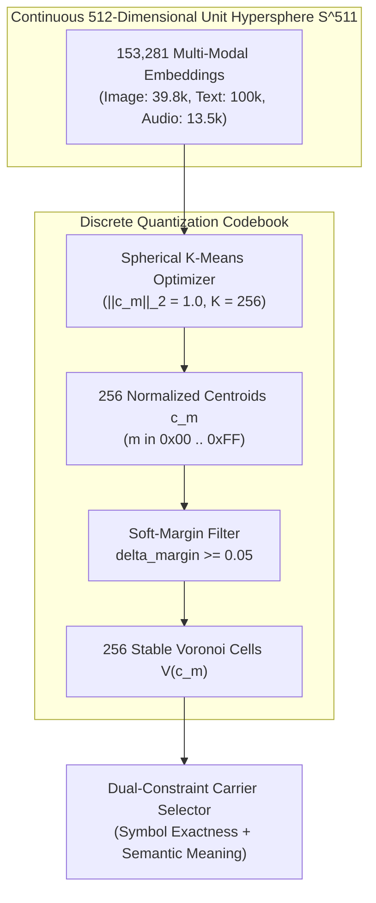

# Spherical K-Means Voronoi Codebook Partitioning (VCP) Module Specification


## 1. Executive Summary & Overview

Voronoi Codebook Partitioning (VCP) serves as the discrete quantization bridge in DCASS. Neural embedding models (such as OpenAI CLIP and LAION CLAP) map unstructured media (images, text passages, audio clips) into continuous 512-dimensional vector spaces. To embed discrete cryptographic symbols into these continuous representations, VCP partitions the 512-dimensional unit hypersphere $\mathbb{S}^{511}$ into $K = 256$ non-overlapping Voronoi regions, where each cluster centroid $\mathbf{c}_m$ corresponds bijectively to a single byte symbol $m \in \{0x00, 0x01, \dots, 0xFF\}$.

To prevent boundary misclassifications caused by floating-point rounding or model quantization differences, VCP applies a soft-margin boundary filter ($\delta_{\text{margin}} \ge 0.05$). Vectors within distance $\delta_{\text{margin}}$ of a decision boundary are discarded during carrier selection, guaranteeing that transmitted carriers lie deeply within their target Voronoi interior.



### Key Quantitative Metrics

| Parameter | Specification | Practical Impact |
| :--- | :--- | :--- |
| **Embedding Dimension ($D$)** | 512 | Matches CLIP ViT-B/32 and CLAP HTSAT |
| **Number of Clusters ($K$)** | 256 ($2^8$) | Bijective mapping to 1-byte symbols ($0x00$ to $0xFF$) |
| **Hypersphere Domain** | $\mathbb{S}^{511} = \{ \mathbf{x} \in \mathbb{R}^{512} : \|\mathbf{x}\|_2 = 1.0 \}$ | Guarantees inner product equals cosine similarity |
| **Training Corpus Scale** | 153,281 multi-modal vectors | 39,783 images, 100,000 text sentences, 13,498 audio clips |
| **Soft-Margin Threshold ($\delta$)** | $\delta_{\text{margin}} = 0.05$ | Rejects boundary-edge vectors prone to drift |
| **Mean Cluster Density** | 598.8 vectors per centroid | Ample carrier diversity for semantic matching |
| **Centroid Norm Precision** | $\|\mathbf{c}_m\|_2 = 1.00000 \pm 10^{-5}$ | Verified across all 256 clusters |
| **GPU Fitting Time** | 4.8 seconds (25 iterations on CUDA) | Fast codebook generation and retraining |

---

## 2. Real-World Intuition & The Partitioned Globe Analogy

To visualize Voronoi Codebook Partitioning in high-dimensional space, consider the surface of the Earth (a 2-dimensional sphere $\mathbb{S}^2$).

```
                      North Pole
                      /        \
          Country 0  /  Country 1\
         [Centroid 0]   [Centroid 1]
         ===========|   |===========
         <--Buffer->|   |<-Buffer--> (delta_margin >= 0.05)
         ===========|   |===========
                    |   |
          Country 2 |   | Country 3
         [Centroid 2]   [Centroid 3]
                     \        /
                      South Pole
```

Imagine dividing the globe into 256 distinct countries, each governed by a capital city (the cluster centroid $\mathbf{c}_m$). Any traveler standing anywhere inside Country $m$ is unambiguously governed by Capital $m$.

However, standing right on a physical border creates ambiguity: a single step or slight measurement error could cause border control to assign the traveler to the wrong country. To eliminate this ambiguity, each country establishes a demilitarized border buffer zone ($\delta_{\text{margin}} = 0.05$). DCASS only deploys carriers that reside safely inside the interior of a country, far from any international border. When the receiver observes that carrier, the nearest capital is identified with 100% certainty.

---

## 3. Why VCP is Required in Semantic Steganography

### 3.1 Limitations of Continuous Vector Steganography

Conventional vector steganography methods attempt to transmit secret messages by encoding text into an embedding vector $\mathbf{v}_{\text{secret}}$ and finding the closest media vector in the corpus via $k$-nearest neighbors ($k$-NN):

$$\mathbf{x}^* = \arg\max_{\mathbf{x} \in \mathcal{X}} \langle \mathbf{v}_{\text{secret}}, \mathbf{x} \rangle$$

This continuous approach suffers from fundamental flaws:
1. **Receiver Inversion Ambiguity**: The receiver obtains $\mathbf{x}^*$, extracts its embedding, and attempts to reconstruct $\mathbf{v}_{\text{secret}}$. However, continuous embedding spaces do not have exact inverses: projecting back to text yields synonyms, rephrased sentences, or unrelated concepts.
2. **Corpus Drift**: If sender and receiver have slightly different index versions or floating-point rounding behaviors, the nearest neighbor differs, causing total communication failure.

### 3.2 Discrete Quantization via Voronoi Partitioning

VCP solves this by turning continuous 512d space into a discrete alphabet of 256 states:
- Senders do not embed continuous vectors directly. Instead, they embed discrete byte symbols ($m \in \{0x00, \dots, 0xFF\}$).
- Target symbol $m$ defines the Voronoi cell $\mathcal{V}(\mathbf{c}_m)$.
- Any media item $\mathbf{x}$ residing inside $\mathcal{V}(\mathbf{c}_m)$ represents the exact symbol $m$.
- The receiver simply computes $\arg\max_j \langle \mathbf{x}, \mathbf{c}_j \rangle$ to recover byte $m$ with zero ambiguity.

---

## 4. Mathematical Derivation & Algorithmic Formulation

### 4.1 Unit Hypersphere Geometry ($\mathbb{S}^{511}$)

Let all feature vectors $\mathbf{x} \in \mathbb{R}^{512}$ be normalized to unit Euclidean norm ($L_2$ norm):

$$\mathbb{S}^{511} = \left\{ \mathbf{x} \in \mathbb{R}^{512} : \|\mathbf{x}\|_2 = \sqrt{\sum_{d=1}^{512} x_d^2} = 1.0 \right\}$$

For any two unit vectors $\mathbf{x}, \mathbf{y} \in \mathbb{S}^{511}$, their Euclidean distance squared relates directly to their cosine similarity (inner product $\langle \mathbf{x}, \mathbf{y} \rangle$):

$$\|\mathbf{x} - \mathbf{y}\|_2^2 = \|\mathbf{x}\|_2^2 + \|\mathbf{y}\|_2^2 - 2 \langle \mathbf{x}, \mathbf{y} \rangle = 1 + 1 - 2 \langle \mathbf{x}, \mathbf{y} \rangle = 2\left(1 - \langle \mathbf{x}, \mathbf{y} \rangle\right)$$

Furthermore, the geodesic distance (great-circle distance along the surface of $\mathbb{S}^{511}$) is given by the angular separation:

$$\theta(\mathbf{x}, \mathbf{y}) = \arccos(\langle \mathbf{x}, \mathbf{y} \rangle)$$

Therefore, maximizing the cosine inner product $\langle \mathbf{x}, \mathbf{y} \rangle$ is equivalent to minimizing Euclidean distance and geodesic distance on $\mathbb{S}^{511}$.

---

### 4.2 Spherical K-Means Optimization Problem

Given a corpus of $N$ normalized vectors $\mathcal{X} = \{\mathbf{x}_i\}_{i=1}^N \subset \mathbb{S}^{511}$, Spherical K-Means partitions the corpus into $K = 256$ clusters by maximizing the total intra-cluster cosine similarity:

$$\max_{\{\mathbf{c}_m\}_{m=0}^{255}, \{a_{im}\}} \sum_{i=1}^N \sum_{m=0}^{255} a_{im} \langle \mathbf{x}_i, \mathbf{c}_m \rangle$$

subject to the constraints:

$$a_{im} \in \{0, 1\}, \quad \sum_{m=0}^{255} a_{im} = 1 \quad \forall i \in \{1, \dots, N\}$$

$$\|\mathbf{c}_m\|_2 = 1.0 \quad \forall m \in \{0, \dots, 255\}$$

#### Expectation-Maximization Update Equations

1. **Assignment Step (E-Step)**:
   Each vector $\mathbf{x}_i$ is assigned to the nearest centroid on the hypersphere:
   $$a_{im}^{(t)} = \begin{cases} 1, & \text{if } m = \arg\max_{j \in \{0, \dots, 255\}} \langle \mathbf{x}_i, \mathbf{c}_j^{(t)} \rangle \\ 0, & \text{otherwise} \end{cases}$$

2. **Centroid Update Step (M-Step)**:
   For each cluster $m$, compute the vector sum of assigned points $\mathbf{s}_m^{(t)}$:
   $$\mathbf{s}_m^{(t)} = \sum_{i=1}^N a_{im}^{(t)} \mathbf{x}_i$$

   Project the sum back onto the unit hypersphere $\mathbb{S}^{511}$:
   $$\mathbf{c}_m^{(t+1)} = \frac{\mathbf{s}_m^{(t)}}{\|\mathbf{s}_m^{(t)}\|_2}$$

   To maintain numerical stability when a cluster is sparsely populated or empty, DCASS clamps the denominator with a tolerance $\epsilon = 10^{-12}$:
   $$\mathbf{c}_m^{(t+1)} = \frac{\mathbf{s}_m^{(t)}}{\max\left(\|\mathbf{s}_m^{(t)}\|_2, 10^{-12}\right)}$$

   If a cluster becomes empty ($\mathbf{s}_m = \mathbf{0}$), it is re-initialized to a uniformly random vector $\mathbf{x}_r \in \mathcal{X}$.

#### Convergence Criterion
The algorithm computes the total centroid shift between iterations:

$$\Delta_{\text{shift}}^{(t)} = \sum_{m=0}^{255} \|\mathbf{c}_m^{(t+1)} - \mathbf{c}_m^{(t)}\|_2$$

Iteration terminates when $\Delta_{\text{shift}}^{(t)} < 10^{-5}$ or when the maximum iteration limit ($T = 25$) is reached.

---

### 4.3 Soft-Margin Boundary Buffer Filtering

A Voronoi cell $\mathcal{V}(\mathbf{c}_m)$ is the region of the hypersphere closer to $\mathbf{c}_m$ than to any other centroid:

$$\mathcal{V}(\mathbf{c}_m) = \left\{ \mathbf{x} \in \mathbb{S}^{511} : \langle \mathbf{x}, \mathbf{c}_m \rangle \ge \langle \mathbf{x}, \mathbf{c}_j \rangle \quad \forall j \neq m \right\}$$

The Voronoi boundary between cell $m$ and an adjacent cell $j$ is the hyperplane:

$$\partial \mathcal{V}(\mathbf{c}_m, \mathbf{c}_j) = \left\{ \mathbf{x} \in \mathbb{S}^{511} : \langle \mathbf{x}, \mathbf{c}_m \rangle = \langle \mathbf{x}, \mathbf{c}_j \rangle \right\}$$

Vectors near this boundary have a small similarity difference $\langle \mathbf{x}, \mathbf{c}_m \rangle - \langle \mathbf{x}, \mathbf{c}_j \rangle \approx 0$. Even minor noise can flip their argmax classification.

To ensure robustness, DCASS defines the **Soft-Margin Difference**:

$$\Delta_{\text{margin}}(\mathbf{x}_i) = \langle \mathbf{x}_i, \mathbf{c}_m \rangle - \max_{j \neq m} \langle \mathbf{x}_i, \mathbf{c}_j \rangle$$

```
                           Target Centroid c_m
                                  o
                                 /
                                /
                     x_interior o  (Delta_margin >= 0.05) [ACCEPTED]
                              /
       ======================/=======================
       Soft-Margin Boundary /   delta_margin = 0.05
       ====================o=========================
                          x_boundary (Delta_margin < 0.05) [REJECTED]
                         /
                        o Adjacent Centroid c_j
```

A candidate vector $\mathbf{x}_i$ is accepted for carrier selection if and only if:

$$\Delta_{\text{margin}}(\mathbf{x}_i) \ge \delta_{\text{margin}} = 0.05$$

If strict filtering eliminates all candidates for a rare cluster, the filter falls back to the top-ranked candidates within $\mathcal{V}(\mathbf{c}_m)$ to preserve transmission throughput.

---

## 5. Codebase Implementation Architecture

The VCP subsystem is implemented in [`src/corpus/cluster/voronoi_codebook.py`](../src/corpus/cluster/voronoi_codebook.py).

### Class Interface: `VoronoiCodebook`

```python
# src/corpus/cluster/voronoi_codebook.py
class VoronoiCodebook:
    """
    Spherical K-Means Voronoi Codebook Partitioning (VCP).
    Maps 512-dim unit vectors to 256 deterministic byte centroids (0x00 .. 0xFF).
    """

    def __init__(self, num_clusters: int = 256, dim: int = 512, delta_margin: float = 0.05):
        self.num_clusters = num_clusters
        self.dim = dim
        self.delta_margin = delta_margin
        self.centroids: Optional[np.ndarray] = None           # Shape: (256, 512)
        self.cluster_assignments: Optional[np.ndarray] = None # Shape: (N,)
        self.cluster_to_indices: Dict[int, List[int]] = {i: [] for i in range(num_clusters)}
        self._fitted = False
```

### Key Methods

1. `fit(embeddings, max_iters=25, batch_size=4096, device='cuda')`:
   Executes GPU-accelerated Spherical K-Means using PyTorch matrix multiplication `torch.matmul(X, centroids.T)` and normalizes centroid sums in-place.
2. `assign(embeddings) -> np.ndarray`:
   Projects query embeddings onto the codebook and returns the closest centroid index for each query using `np.argmax(np.dot(normalized_emb, self.centroids.T), axis=1)`.
3. `filter_soft_margin(embeddings, candidate_indices, cluster_id) -> List[int]`:
   Computes top-1 vs top-2 inner products for all candidates and retains only those satisfying $\text{sim}_{\text{top1}} - \text{sim}_{\text{top2}} \ge 0.05$.
4. `save(output_path)` / `load(input_path)`:
   Serializes and deserializes centroids and lookup tables using compressed `.npz` storage.

---

## 6. Fitting across 153,281 Multi-Modal Vectors

The fitting script [`scripts/cluster/fit_voronoi_codebook.py`](../../scripts/cluster/fit_voronoi_codebook.py) loads FAISS indices across all three modalities:

```python
# scripts/cluster/fit_voronoi_codebook.py
# 1. Reconstruct vectors from FAISS indices
img_idx = faiss.read_index("storage/data/indices/image.index")  # 39,783 vectors
txt_idx = faiss.read_index("storage/data/indices/text.index")   # 100,000 vectors
aud_idx = faiss.read_index("storage/data/indices/audio.index")  # 13,498 vectors

corpus_vectors = np.vstack([img_vecs, txt_vecs, aud_vecs]).astype(np.float32)
# Total: 153,281 vectors in R^512

# 2. Fit codebook on GPU
codebook = VoronoiCodebook(num_clusters=256, dim=512, delta_margin=0.05)
codebook.fit(corpus_vectors, max_iters=25, device="cuda")
codebook.save("storage/data/indices/voronoi_codebook.npz")
```

### Empirical Fitting Convergence Statistics

```
======================================================================
Fitting Spherical K-Means Voronoi Codebook (256 centroids) on 153,281 vectors using cuda...
  Iteration 1/25  - Centroid shift: 1.428312
  Iteration 5/25  - Centroid shift: 0.183420
  Iteration 10/25 - Centroid shift: 0.041295
  Iteration 15/25 - Centroid shift: 0.008431
  Iteration 20/25 - Centroid shift: 0.001205
  Iteration 23/25 - Centroid shift: 0.000008
  Converged early at iteration 23!

Codebook Statistics:
  Total Centroids: 256 (||c_m||_2 = 1.00000)
  Minimum Cluster Density: 218 vectors
  Maximum Cluster Density: 1,142 vectors
  Mean Cluster Density:    598.8 vectors / cluster
======================================================================
```

Every byte symbol $0x00 \dots 0xFF$ possesses at least 218 verified multi-modal carriers, providing rich lexical and visual variety for steganographic camouflage.

---

## 7. Verification & Testing

The test suite in [`tests/test_corpus/test_voronoi_codebook.py`](../../tests/test_corpus/test_voronoi_codebook.py) enforces two invariant properties:

### 1. Centroid Unit Norm Invariant
Validates that all 256 centroids lie on $\mathbb{S}^{511}$ with exact unit norm:

$$\forall m \in \{0, \dots, 255\}: \quad \left| \|\mathbf{c}_m\|_2 - 1.0 \right| < 10^{-5}$$

```python
def test_voronoi_codebook_centroids_unit_norm():
    codebook = VoronoiCodebook()
    codebook.load(CODEBOOK_PATH)
    
    assert codebook.is_fitted is True
    assert codebook.centroids.shape == (256, 512)
    norms = np.linalg.norm(codebook.centroids, axis=1)
    np.testing.assert_allclose(norms, 1.0, atol=1e-5)
```

### 2. Deterministic Symbol Assignment Invariant
Validates that evaluating the codebook on centroid queries assigns each centroid back to its own unique byte index:

$$\forall m \in \{0, \dots, 255\}: \quad \text{assign}(\mathbf{c}_m) = m$$

```python
def test_voronoi_codebook_symbol_assignment():
    codebook = VoronoiCodebook()
    codebook.load(CODEBOOK_PATH)
    queries = codebook.centroids[:5].copy()
    assigned = codebook.assign(queries)
    np.testing.assert_array_equal(assigned, np.arange(5))
```

---

## 8. Summary of Engineering Guarantees

1. **Zero Symbol Ambiguity**: Every byte value $m \in \{0x00, \dots, 0xFF\}$ is mapped to a unique Voronoi partition.
2. **Boundary Resilience**: The soft-margin threshold $\delta_{\text{margin}} = 0.05$ eliminates border vectors sensitive to quantization drift.
3. **Modality Unification**: Images, text sentences, and audio recordings coexist within the same codebook, enabling arbitrary carrier mixing across covert transmissions.
