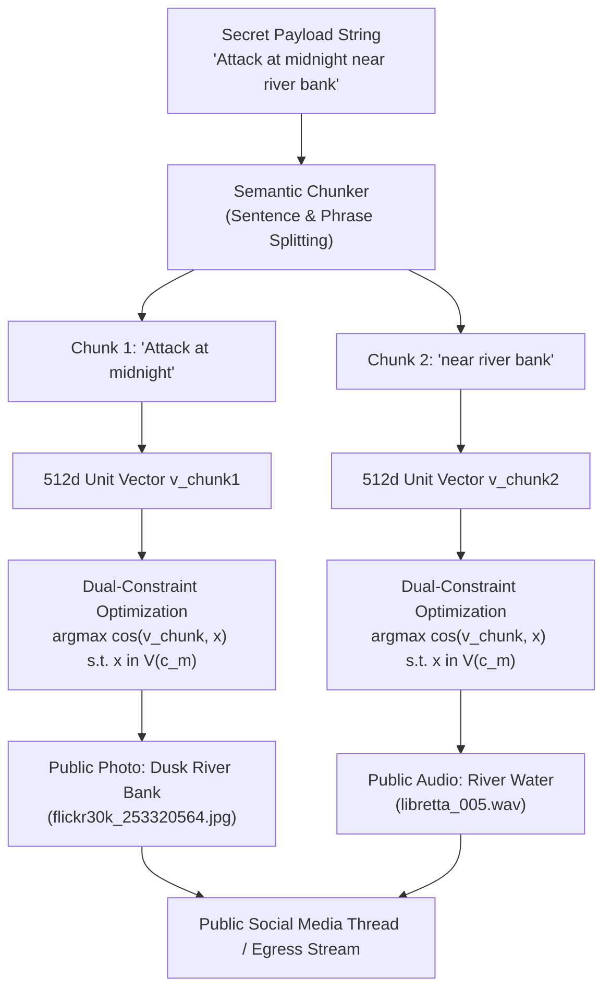
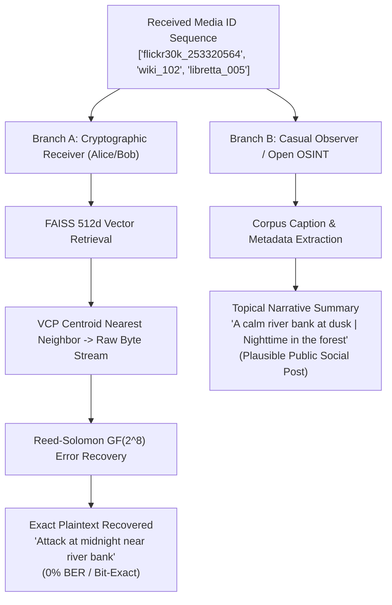

# Module 04: Semantic Chunking and Dual-Constraint Carrier Selection


## 1. Executive Intuition and Conceptual Analogy

### 1.1 The Cover Story Analogy
Imagine an undercover operative who wants to transmit a secret instruction to a colleague across a public messaging platform without raising suspicion. Instead of attempting to hide microscopic ink inside the pixels of an image or encrypting text into unreadable ciphertext (which immediately triggers network inspection alarms), the operative posts a coherent series of travel photographs and travel captions.

If the secret message is:
> *"Attack at midnight near river bank"*

A naive steganographic approach would alter pixel least significant bits (LSBs) of a single photo, leaving a distinct high-frequency noise signature that convolutional neural networks detect in milliseconds. 

DCASS takes an entirely different approach:
1. It splits the secret message into logical semantic concepts: *"Attack at midnight"* and *"near river bank"*.
2. It searches a public database of 153,281 authentic media files to find items that naturally discuss or depict nighttime and river banks.
3. It selects media items whose mathematical vector cluster coordinates simultaneously match the exact cryptographic byte symbols of the secret message.

An eavesdropper reading the public social media thread sees a photo of a serene river bank at dusk, a quote about midnight stillness, and a short audio clip of flowing river water. The sequence appears completely natural, harmless, and contextually consistent, while the receiver extracts the exact secret message with zero bit errors.



---

## 2. The Dual-Constraint Carrier Selection Principle

### 2.1 Why Media Items "Skewly" Match the Secret Story
When inspecting the media selected by DCASS for a given payload, observers notice that the cover media items (images, sentences, and audio clips) exhibit a strong topical relationship to the secret payload, yet they do not display the exact plaintext text. 

For example, when encoding the phrase `"near river bank"`, the system selects an image of a river bank rather than a picture of an automobile. This topical alignment is not an accident; it is the direct mathematical consequence of **Dual-Constraint Optimization**.

```
                        DUAL-CONSTRAINT SELECTION GEOMETRY
        
               Unit Hypersphere S^511 (512-Dimensional Vector Space)
        ┌─────────────────────────────────────────────────────────────────┐
        │                                                                 │
        │                     Voronoi Cell V(c_m)                         │
        │             (Encodes Byte Symbol m = 0x2A)                      │
        │        ┌────────────────────────────────────────┐               │
        │        │                                        │               │
        │        │   x_1 (Image of River Bank)            │               │
        │        │      *  <-- HIGHEST COSINE SIMILARITY  │               │
        │        │             TO v_chunk (0.84)          │               │
        │        │                                        │               │
        │        │   x_2 (Text about Water Flow)          │               │
        │        │      *                                 │               │
        │        │                                        │               │
        │        │   x_3 (Audio of Stream)                │               │
        │        │      *                                 │               │
        │        └────────────────────────────────────────┘               │
        │                            ▲                                    │
        │                            │ Direction of                       │
        │                            │ v_chunk ("near river bank")        │
        │                            │                                    │
        │                     Centroid c_m                                │
        │                          *                                      │
        └─────────────────────────────────────────────────────────────────┘
```

### 2.2 Mathematical Formulation
Let $\mathbb{S}^{511} = \{ \mathbf{v} \in \mathbb{R}^{512} : \|\mathbf{v}\|_2 = 1.0 \}$ denote the 512-dimensional unit hypersphere.

Let $\mathcal{C} = \{ \mathbf{c}_0, \mathbf{c}_1, \dots, \mathbf{c}_{255} \} \subset \mathbb{S}^{511}$ represent the 256 cluster centroids established during Spherical K-Means Voronoi Codebook Partitioning, where each centroid $\mathbf{c}_m$ uniquely represents an 8-bit byte symbol $m \in \{ \texttt{0x00}, \dots, \texttt{0xFF} \}$.

Let $\mathcal{V}(\mathbf{c}_m)$ denote the Voronoi region on $\mathbb{S}^{511}$ associated with centroid $\mathbf{c}_m$:

$$\mathcal{V}(\mathbf{c}_m) = \left\{ \mathbf{x} \in \mathbb{S}^{511} : \langle \mathbf{x}, \mathbf{c}_m \rangle \ge \langle \mathbf{x}, \mathbf{c}_j \rangle \quad \forall j \neq m \right\}$$

When transmitting payload symbol $m_i$ corresponding to semantic text chunk $T_k$, the selection engine computes the normalized chunk embedding $\mathbf{v}_{\text{chunk}} = f_{\text{CLIP}}(T_k) / \|f_{\text{CLIP}}(T_k)\|_2 \in \mathbb{S}^{511}$.

The carrier media item $\mathbf{x}^*$ is chosen by solving the following constrained optimization problem:

$$\mathbf{x}^* = \arg\max_{\mathbf{x} \in \mathcal{V}(\mathbf{c}_{m_i})} \langle \mathbf{v}_{\text{chunk}}, \mathbf{x} \rangle$$

Subject to:
1. **Symbol Condition (Exactness)**: $\mathbf{x}^* \in \mathcal{V}(\mathbf{c}_{m_i})$. The selected item must map deterministically to the target byte symbol $m_i$ during reverse Voronoi lookup at the receiver.
2. **Semantic Similarity Condition (Stealth)**: $\mathbf{x}^*$ must maximize the inner product (cosine similarity) with the secret semantic chunk $\mathbf{v}_{\text{chunk}}$ among all candidate items contained within $\mathcal{V}(\mathbf{c}_{m_i})$.
3. **Soft-Margin Safety Condition**: $\Delta_{\text{margin}}(\mathbf{x}^*) = \langle \mathbf{x}^*, \mathbf{c}_{m_i} \rangle - \max_{j \neq m_i} \langle \mathbf{x}^*, \mathbf{c}_j \rangle \ge \delta_{\text{margin}}$, with default threshold $\delta_{\text{margin}} = 0.05$.

Because each Voronoi cell contains on average $\bar{\rho} \approx 598.8$ candidate media items across image, text, and audio channels, the optimization space within each cell is dense enough to find an item with high topical affinity to $\mathbf{v}_{\text{chunk}}$.

---

## 3. Mathematical Derivation of Linguistic Chunking

### 3.1 Sentence and Phrase Boundary Decomposition
The text chunking subsystem implemented in [`src/engine/chunker.py`](../../src/engine/chunker.py) transforms continuous text into discrete semantic chunks using a hierarchical linguistic pipeline.

```
+-----------------------------------------------------------------------------+
|                           LINGUISTIC CHUNKING PIPELINE                      |
|                                                                             |
|  Input Text: "Meet me at the cafe, bring the documents before sunrise."     |
|                                                                             |
|  Step 1: Sentence Splitting (Lookbehind Regex: (?<=[.!?])\s+)               |
|          -> ["Meet me at the cafe, bring the documents before sunrise."]     |
|                                                                             |
|  Step 2: Delimiter & Clause Splitting                                       |
|          -> ["Meet me at the cafe", "bring the documents", "before sunrise"]|
|                                                                             |
|  Step 3: Length Verification & Sub-Splitting                                |
|          Enforces: L_min = 3 chars, L_max = 60 chars                        |
|                                                                             |
|  Step 4: Lexical Normalization & Synonym Expansion                          |
|          -> [Chunk(0: "meet me at the cafe"),                               |
|              Chunk(1: "bring the documents"),                               |
|              Chunk(2: "before sunrise dawn daybreak")]                      |
+-----------------------------------------------------------------------------+
```

### 3.2 Splitting Rules and Prepositional Boundaries
When a clause exceeds the maximum character threshold ($L_{\max} = 60$), the chunker does not split arbitrarily in the middle of words. It searches for optimal split points within the preferred range $[0.4 \cdot L_{\max}, \, 0.9 \cdot L_{\max}]$ using natural syntactic boundaries:
- **Prepositional breaks**: `in`, `on`, `at`, `for`, `of`, `to`, `from`, `with`, `about`, `around`, `through`, `between`
- **Article breaks**: `the`, `a`, `an`, `this`, `that`, `these`, `those`
- **Clause delimiters**: commas, semicolons, and conjunctions (`and`, `but`, `while`, `when`, `where`, `which`, `that`)

### 3.3 Lexical Synonym Expansion
To maximize vector alignment with public corpus captions, the chunker optionally enriches key tokens with contextual synonyms:

$$T_{\text{expanded}} = T_{\text{clean}} \cup \left\{ \text{Syn}(w)_0 : w \in T_{\text{clean}}, \, w \in \text{DomainDictionary} \right\}$$

For example, the token `"sunrise"` expands to `"sunrise dawn"`, allowing the downstream CLIP text encoder to produce an embedding closer to Flickr image captions such as `"a woman standing at dawn"`.

---

## 4. Codebase Architecture and Implementation

### 4.1 Chunking Subsystem (`src/engine/chunker.py`)
The primary class is [`SemanticChunker`](../../src/engine/chunker.py#L38-L402), which returns structured [`SemanticChunk`](../../src/engine/chunker.py#L26-L36) objects:

```python
# From src/engine/chunker.py
@dataclass
class SemanticChunk:
    text: str           # Chunk text (with optional synonym expansion)
    original: str       # Pristine text before expansion
    index: int          # 0-based sequence position in the message
```

Key configuration parameters:
- `min_chunk_length`: 3 characters (prevents noisy single-letter queries).
- `max_chunk_length`: 60 characters (maintains compact, coherent semantic units).
- `split_sentences`: `True` (uses regex `(?<=[.!?])\s+`).
- `expand_synonyms`: `True` (enables lexical enrichment).

### 4.2 Encoding Subsystem (`src/engine/encoder.py`)
The encoding workflow in [`SemanticEncoder.encode()`](file:///home/jeevan/projects/DCASS/src/engine/encoder.py#L233-L372) executes in four sequential stages:

```python
# Encoding execution workflow in SemanticEncoder
# 1. (Optional) Protect payload with Reed-Solomon GF(2^8) parity
if use_ecc:
    rs_ecc = RSErrorCorrection(parity_bytes=ecc_parity_bytes)
    ecc_codeword = rs_ecc.encode(message)

# 2. Chunk the secret message into semantic units
chunks = self.chunker.chunk(message)

# 3. For each chunk, search the multi-modal FAISS index
for chunk_idx, chunk in enumerate(chunks):
    results = self.index.search(
        query=chunk.text,
        k=search_k,
        modalities=search_modalities,
        min_score=min_score
    )
    
    # 4. Rank candidates using lexical overlap and modality balancing
    results = sorted(
        results,
        key=lambda r: _candidate_text_score(chunk.original, r),
        reverse=True
    )
    selected = results[:k_per_chunk]
```

#### Lexical Ranking Heuristic
To prevent semantic drift where an embedding is close in high-dimensional space but loses key keywords, the encoder applies a lexical bias scoring function:

$$\text{Score}_{\text{final}}(x) = \text{Score}_{\text{norm}}(x) + 0.35 \cdot \left( \frac{|\text{Keywords}(T) \cap \text{Tokens}(x)|}{|\text{Keywords}(T)|} \right) + \text{Bonus}_{\text{phrase}} + \text{Bonus}_{\text{modality}}$$

Where:
- $\text{Bonus}_{\text{phrase}} = 0.08$ if the full chunk text appears as an exact substring.
- $\text{Bonus}_{\text{modality}} = 0.04$ for text modality candidates.

#### Multi-Modal Diversity Modes
The encoder supports three diversity policies:
1. `best`: Selects highest-scoring media item across all modalities.
2. `round_robin`: Cycles strictly through available modalities (`Image` -> `Text` -> `Audio` -> `Image`).
3. `balanced`: Dynamically selects the least-utilized modality to ensure equal distribution across egress channels.

### 4.3 Decoding Subsystem (`src/engine/decoder.py`)
The decoding engine in [`SemanticDecoder.decode()`](file:///home/jeevan/projects/DCASS/src/engine/decoder.py#L191-L256) processes incoming sequences of media IDs:

```python
# Decoding workflow in SemanticDecoder
for media_id in media_ids:
    item = self.index.get_by_id(media_id)
    if item:
        content = extract_semantic_content(item.metadata, item.modality)
        decoded_items.append(DecodedItem(
            media_id=media_id,
            modality=item.modality,
            content=content,
            verified=True,
            file_path=item.file_path
        ))
```

Corpus verification detects in-transit tampering. If an attacker replaces a media ID with an arbitrary file not present in the pre-shared index, `verified` evaluates to `False`, alerting the receiver to active tampering.

---

## 5. Exact Payload Reconstruction vs. Semantic Summary Extraction

DCASS provides a two-tiered extraction capability depending on whether the receiver possesses the cryptographic codebook keys or is performing open-source intelligence analysis:

| Property | Tier 1: Exact Payload Reconstruction | Tier 2: Semantic Summary Extraction |
| :--- | :--- | :--- |
| **Extraction Mechanism** | Voronoi Symbol Decoder + RS-ECC Berlekamp-Massey | Metadata extraction (`extract_semantic_content`) |
| **Mathematical Precision** | **100.0% bit-exact match (0% Bit Error Rate)** | High-level contextual story gist |
| **Output Type** | Exact ASCII/UTF-8 plaintext byte string | Joined string of captions and text lines |
| **Required Assets** | Codebook centroids (`voronoi_codebook.npz`) + RS parameters | Public corpus index metadata |
| **Example Output** | `"Attack at midnight near river bank"` | `"A river bank at sunset | Night stillness over water"` |



---

## 6. Summary of Key Implementation Parameters

| Parameter | Configuration Value | Location in Codebase |
| :--- | :---: | :--- |
| **Hypersphere Dimension** | 512 dimensions ($\mathbb{S}^{511}$) | [`src/corpus/cluster/voronoi_codebook.py`](file:///home/jeevan/projects/DCASS/src/corpus/cluster/voronoi_codebook.py#L27) |
| **Minimum Chunk Length** | 3 characters | [`src/engine/chunker.py`](file:///home/jeevan/projects/DCASS/src/engine/chunker.py#L163) |
| **Maximum Chunk Length** | 60 characters | [`src/engine/chunker.py`](file:///home/jeevan/projects/DCASS/src/engine/chunker.py#L164) |
| **Soft-Margin Threshold ($\delta_{\text{margin}}$)** | 0.05 | [`src/corpus/cluster/voronoi_codebook.py`](file:///home/jeevan/projects/DCASS/src/corpus/cluster/voronoi_codebook.py#L27) |
| **Default Modalities** | `["image", "text", "audio"]` | [`src/engine/encoder.py`](file:///home/jeevan/projects/DCASS/src/engine/encoder.py#L193) |
| **Corpus Scale** | 153,281 indexed vectors | [`storage/data/indices/`](file:///home/jeevan/projects/DCASS/storage/data/indices/) |
