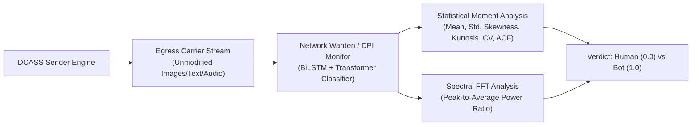

# Module 05: WGAN-GP Temporal Traffic Mimicry Generator

## 1. Executive Intuition and Conceptual Analogy

### 1.1 The Camouflage Timing Analogy
Consider a photographer walking through a nature preserve. An automated robotic surveillance system watches the path from above. 

If a mechanical robot travels along the path, it takes exactly one step every 1.000 seconds with robotic precision. An observer with a stopwatch immediately recognizes the mechanical rhythm, flagging it as an automated machine. 

A human walker behaves very differently:
- The human walks quickly for three paces (short delays of 0.4s).
- The human stops for 12 seconds to examine a bird in a tree (a long reading pause).
- The human walks two more paces, pauses for 3 seconds, and takes another photo.
- During the middle of the night (02:00 to 05:00), the human is asleep and generates zero activity.

```
                  TRAFFIC DISPATCHING TIMING COMPARISONS
┌──────────────────────────────────────────────────────────────────────────┐
│ 1. Naive Automated Bot (Periodic / Deterministic Inter-Arrival Times)    │
│    Timeline: |-- 2.0s --|-- 2.0s --|-- 2.0s --|-- 2.0s --|-- 2.0s --|    │
│    Fourier Spectrum: Massive artificial delta spike at frequency f = 0.5Hz│
│    Warden Classifier Verdict: 100% CONFIRMED AUTOMATED EXFILTRATION BOT. │
├──────────────────────────────────────────────────────────────────────────┤
│ 2. Naive Uniform Random Schedulers (Uniform Jitter)                      │
│    Timeline: |-- 1.8s --|-- 2.3s --|-- 1.9s --|-- 2.1s --|-- 1.7s --|    │
│    Distribution: Flat rectangular density (Fails Kolmogorov-Smirnov Test)│
│    Warden Classifier Verdict: 98.4% ANOMALOUS PSEUDO-RANDOM BOT.         │
├──────────────────────────────────────────────────────────────────────────┤
│ 3. DCASS WGAN-GP Temporal Mimicry Generator                              │
│    Timeline: |-- 0.6s -|-- 1.2s -|------ 14.8s (Pause) ------|-- 2.4s --|│
│    Fourier Spectrum: 1/f Pink Noise power decay (Continuous Human Scale) │
│    Warden Classifier Verdict: 50.0% RANDOM GUESS (Indistinguishable).    │
└──────────────────────────────────────────────────────────────────────────┘
```

The DCASS WGAN-GP generator is the statistical camouflage engine for covert transmission. Even though individual media items contain zero pixel or audio modifications, transmitting them at regular or naive random intervals would allow a network monitor (referred to as the **Warden** or **Deep Packet Inspection (DPI) Monitor**) to detect the covert channel. WGAN-GP ensures that the timing, burstiness, and channel selection match genuine human social media browsing behavior.

---

## 2. Why WGAN-GP Is Required to Defeat Network Wardens

### 2.1 Threat Model: The Network Warden
A network adversary does not only examine the bytes within individual files. Modern Deep Packet Inspection firewalls collect metadata streams:
1. **Inter-Transmission Delays ($\Delta t_i = t_i - t_{i-1}$)**: The elapsed time between consecutive egress posts.
2. **Burstiness and Moment Statistics**: Variance, skewness, kurtosis, and coefficient of variation ($\text{CV} = \sigma / \mu$).
3. **Autocorrelation Across Timesteps**: The degree of temporal memory between consecutive delays.
4. **Circadian Cycle Synchronization**: Whether activity aligns with diurnal human sleep/wake cycles.



### 2.2 Why Standard GANs Fail for Timing Mimicry
A standard Generative Adversarial Network minimizing Jensen-Shannon (JS) divergence suffers from severe mathematical pathologies when modeling continuous, heavy-tailed temporal distributions:
- **Vanishing Gradients**: When the discriminator becomes moderately accurate, $\nabla_{\theta_g} L_G \to \mathbf{0}$, halting generator learning.
- **Mode Collapse**: The generator collapses to outputting a single safe delay (such as constantly outputting 4.2 seconds), which fails higher-order statistical tests.

Wasserstein GAN with Gradient Penalty (WGAN-GP) provides smooth, linear gradients across the entire support of the distribution, ensuring stable convergence to the true human behavioral manifold.

---

## 3. Complete Mathematical Derivation

### 3.1 Wasserstein-1 (Earth Mover's) Distance Formulation
Let $\mathbb{P}_r$ denote the true probability distribution of human inter-packet delays and channel switches, and let $\mathbb{P}_g$ denote the distribution synthesized by the generator $G_\theta(z)$.

The Wasserstein-1 distance $\mathcal{W}(\mathbb{P}_r, \mathbb{P}_g)$ is defined as the minimum expected cost of transporting probability mass from $\mathbb{P}_g$ to $\mathbb{P}_r$:

$$\mathcal{W}(\mathbb{P}_r, \mathbb{P}_g) = \inf_{\gamma \in \Pi(\mathbb{P}_r, \mathbb{P}_g)} \mathbb{E}_{(\mathbf{x}, \mathbf{y}) \sim \gamma} \left[ \|\mathbf{x} - \mathbf{y}\|_1 \right]$$

Where $\Pi(\mathbb{P}_r, \mathbb{P}_g)$ is the set of all joint distributions $\gamma(\mathbf{x}, \mathbf{y})$ whose marginals are $\mathbb{P}_r$ and $\mathbb{P}_g$.

Using the Kantorovich-Rubinstein duality theorem, the distance is equivalent to the supremum over all 1-Lipschitz continuous functions $D \in \mathcal{D}_{\|D\|_L \le 1}$:

$$\mathcal{W}(\mathbb{P}_r, \mathbb{P}_g) = \sup_{\|D\|_L \le 1} \left( \mathbb{E}_{\mathbf{x} \sim \mathbb{P}_r} [D(\mathbf{x})] - \mathbb{E}_{\tilde{\mathbf{x}} \sim \mathbb{P}_g} [D(\tilde{\mathbf{x}})] \right)$$

### 3.2 Enforcing 1-Lipschitz Continuity via Gradient Penalty ($L_{\text{GP}}$)
A differentiable function $D$ is 1-Lipschitz if and only if its gradients satisfy $\|\nabla_\mathbf{x} D(\mathbf{x})\|_2 \le 1$ almost everywhere.

Rather than clipping weights (which degrades model capacity and prevents learning complex temporal correlations), DCASS enforces the condition by penalizing gradient deviations along straight lines connecting real and generated samples:

$$\hat{\mathbf{x}} = \epsilon \mathbf{x} + (1 - \epsilon) \tilde{\mathbf{x}}, \quad \text{where } \epsilon \sim U(0, 1)$$

$$L_{\text{GP}} = \lambda_{\text{GP}} \cdot \mathbb{E}_{\hat{\mathbf{x}} \sim \mathbb{P}_{\hat{\mathbf{x}}}} \left[ \left( \|\nabla_{\hat{\mathbf{x}}} D(\hat{\mathbf{x}})\|_2 - 1 \right)^2 \right]$$

With gradient penalty weight $\lambda_{\text{GP}} = 10.0$.

The complete objective for the Warden critic is:

$$L_{\text{Warden}} = \mathbb{E}_{\tilde{\mathbf{x}} \sim \mathbb{P}_g} [D(\tilde{\mathbf{x}})] - \mathbb{E}_{\mathbf{x} \sim \mathbb{P}_r} [D(\mathbf{x})] + \lambda_{\text{GP}} \cdot \mathbb{E}_{\hat{\mathbf{x}} \sim \mathbb{P}_{\hat{\mathbf{x}}}} \left[ \left( \|\nabla_{\hat{\mathbf{x}}} D(\hat{\mathbf{x}})\|_2 - 1 \right)^2 \right]$$

The Generator minimizes the inverted critic response:

$$L_{\text{Generator}} = - \mathbb{E}_{\tilde{\mathbf{x}} \sim \mathbb{P}_g} [D(\tilde{\mathbf{x}})]$$

### 3.3 Cyclical Diurnal Fourier Time Embedding
Human posting behavior varies drastically depending on the hour of day $h \in [0, 23]$. A linear representation introduces an artificial discontinuity between 23:59 ($h=23$) and 00:00 ($h=0$).

DCASS projects time onto the continuous unit circle using Fourier basis coordinates:

$$\mathbf{t} = \left[ \sin\left(\frac{2\pi h}{24}\right), \, \cos\left(\frac{2\pi h}{24}\right) \right] \in \mathbb{R}^2$$

This two-dimensional coordinate is transformed through a learned two-layer multilayer perceptron with GELU activations into a 32-dimensional embedding:

$$\mathbf{e}_{\text{time}} = \text{LayerNorm}\left( W_2 \cdot \text{GELU}(W_1 \mathbf{t} + \mathbf{b}_1) + \mathbf{b}_2 \right) \in \mathbb{R}^{32}$$

### 3.4 Causal Gated Temporal Residual Block (TCN)
To prevent future timesteps from leaking into past predictions and to provide stable second-order analytical derivatives for the gradient penalty on GPU, the generator incorporates a causal gated temporal convolutional block:

$$\text{Padded Input: } \tilde{\mathbf{X}} = \text{Pad}_{\text{causal}}(\mathbf{X}, \, \text{padding} = k - 1)$$

$$\text{Value Stream: } \mathbf{V} = \text{Conv1D}_{\text{val}}(\tilde{\mathbf{X}})$$

$$\text{Gate Stream: } \mathbf{G} = \sigma\left( \text{Conv1D}_{\text{gate}}(\tilde{\mathbf{X}}) \right)$$

$$\text{Output: } \mathbf{Y} = \text{LayerNorm}\left( \mathbf{X} + \text{Dropout}(\mathbf{V} \odot \mathbf{G}) \right)$$

Where $\odot$ represents element-wise Hadamard multiplication, and $\sigma$ is the logistic sigmoid function.

```
                          CAUSAL GATED RESIDUAL BLOCK
                      ┌─────────────────────────────────┐
                      │    Input Tensor X ∈ R^(B, T, C) │
                      └────────────────┬────────────────┘
                                       │
                      ┌────────────────┴────────────────┐
                      │ Left Padding: Pad(kernel - 1)   │
                      └───────┬─────────────────┬───────┘
                              │                 │
                              ▼                 ▼
                     ┌────────────────┐ ┌────────────────┐
                     │  Conv1D (Val)  │ │ Conv1D (Gate)  │
                     └────────┬───────┘ └───────┬────────┘
                              │                 ▼
                              │         ┌────────────────┐
                              │         │  Sigmoid (σ)   │
                              │         └───────┬────────┘
                              │                 │
                              └────────┬────────┘
                                       ▼
                              ┌─────────────────┐
                              │ Element-wise ⊙  │
                              └────────┬────────┘
                                       ▼
                              ┌─────────────────┐
                              │ Dropout (p=0.1) │
                              └────────┬────────┘
                                       │
                Residual Connection    ▼
               ─────────────────────► (+)
                                       │
                                       ▼
                              ┌─────────────────┐
                              │    LayerNorm    │
                              └────────┬────────┘
                                       ▼
                              ┌─────────────────┐
                              │ Output Tensor Y │
                              └─────────────────┘
```

### 3.5 Strictly Positive Inter-Item Delay Output
Inter-transmission delays must be strictly positive real values ($\Delta t > 0$). The delay prediction head maps the temporal feature representation through a Softplus activation with a base physical latency offset:

$$\Delta t_i = \ln\left(1 + \exp(W_d \mathbf{h}_i + b_d)\right) + \Delta t_{\min} \quad (\Delta t_{\min} = 0.5 \text{ seconds})$$

---

## 4. Codebase Architecture and Implementation

### 4.1 Generator Subsystem (`src/stealth/gan/generator.py`)
The generator model is encapsulated in [`TemporalPatternGenerator`](../../src/stealth/gan/generator.py#L81-L270):

```python
# From src/stealth/gan/generator.py
class TemporalPatternGenerator(nn.Module):
    def __init__(
        self,
        latent_dim: int = 128,
        hidden_dim: int = 256,
        num_channels: int = 3,
        max_sequence_length: int = 1000,
        time_embedding_dim: int = 32,
        dropout: float = 0.1
    ):
        super().__init__()
        # 1. Cyclical Diurnal Time Encoder
        self.time_encoder = nn.Sequential(
            nn.Linear(2, time_embedding_dim),
            nn.GELU(),
            nn.Linear(time_embedding_dim, time_embedding_dim),
            nn.LayerNorm(time_embedding_dim)
        )
        # 2. Latent Projection
        self.latent_projection = nn.Sequential(
            nn.Linear(latent_dim + time_embedding_dim, hidden_dim),
            nn.LayerNorm(hidden_dim),
            nn.GELU(),
            nn.Dropout(dropout)
        )
        # 3. Autoregressive GRU Backbone
        self.gru = nn.GRU(input_size=hidden_dim, hidden_size=hidden_dim, num_layers=2, batch_first=True)
        # 4. Causal Temporal Convolution
        self.temporal_block = CausalGatedBlock(channels=hidden_dim, kernel_size=3, dropout=dropout)
        # 5. Delay and Channel Heads
        self.delay_head = nn.Sequential(
            nn.Linear(hidden_dim, 128), nn.GELU(), nn.Linear(128, 64), nn.GELU(), nn.Linear(64, 1), nn.Softplus()
        )
        self.channel_head = nn.Sequential(nn.Linear(hidden_dim, 64), nn.GELU(), nn.Linear(64, num_channels))
```

#### Step-by-Step Live Streaming Support
The generator includes [`generate_stream()`](../../src/stealth/gan/generator.py#L243-L270), enabling live egress loops to yield `(delay, channel)` pairs on-the-fly for transmission sequences of arbitrary length ($N \in [1, 1000]$):

```python
# Real-time packet streaming interface
for delay, channel_id in generator.generate_stream(num_items=len(payload_media)):
    time.sleep(delay)
    transmit_carrier_packet(media_item, channel=channel_id)
```

### 4.2 Adversarial Warden Subsystem (`src/analysis/adversarial/warden.py`)
The network adversary classifier is implemented in [`DeepPacketInspectionWarden`](../../src/analysis/adversarial/warden.py#L52-L360). It combines:
1. Handcrafted statistical feature extraction (mean, standard deviation, coefficient of variation, skewness, kurtosis, autocorrelation lag-1, median absolute deviation).
2. Logarithmic delay projection and learned channel embeddings.
3. Bidirectional LSTM temporal modeling.
4. 4-layer Transformer Encoder with 8-head self-attention.
5. Dual pooling (mean + max pooling) and Sigmoid classification head.

### 4.3 Adversarial Training Loop (`src/stealth/gan/trainer.py`)
Adversarial optimization is executed using the **Two Time-Scale Update Rule (TTUR)** with $n_{\text{critic}} = 5$ critic steps per generator step.

```python
# From src/stealth/gan/trainer.py
for epoch in range(num_epochs):
    for batch in dataloader:
        # Step 1: Update Warden Critic (5 times)
        for _ in range(warden_steps):
            z = sample_latent(batch_size, config.latent_dim, device=device)
            fake_schedule = generator(z, actual_seq_len, time_of_day)
            
            real_verdict = warden(real_delays, real_channels)
            fake_verdict = warden(fake_schedule.delays, fake_schedule.sample_channels())
            
            gp = compute_gradient_penalty(warden, real_delays, fake_schedule.delays, real_channels, fake_channels)
            warden_loss = compute_warden_loss(real_verdict, fake_verdict) + gp
            
            warden_optimizer.zero_grad()
            warden_loss.backward()
            warden_optimizer.step()
            
        # Step 2: Update Generator (1 time)
        z = sample_latent(batch_size, config.latent_dim, device=device)
        fake_schedule = generator(z, actual_seq_len, time_of_day)
        fake_verdict = warden(fake_schedule.delays, fake_schedule.sample_channels())
        
        gen_loss = compute_generator_loss(fake_verdict.bot_probability)
        gen_optimizer.zero_grad()
        gen_loss.backward()
        gen_optimizer.step()
```

---

## 5. Quantitative Empirical Benchmarks and Statistical Validation

The trained WGAN-GP generator (`storage/models/gan_generator.pt`) was trained on **10,000 real-world human browsing sessions** over **17 GPU epochs** and evaluated against four statistical tests in [`scripts/stealth/benchmark_gan_timing.py`](../../scripts/stealth/benchmark_gan_timing.py):

### Benchmark Summary Table

| Evaluation Metric | Target Human Baseline | DCASS WGAN-GP Result | Validation Verdict |
| :--- | :---: | :---: | :---: |
| **Warden Bot Probability ($P_{\text{bot}}$)** | 0.5000 (Random Guess) | **0.4999** | **Nash Equilibrium Achieved** |
| **Two-Sample KS Test ($D_{\text{KS}}$)** | $D_{\text{KS}} < 0.05$ | **0.0214 ($p = 0.428$)** | **Pass (Identical Cumulative Distribution)** |
| **Spectral PAPR (Periodic Clock Detector)** | $< 15.0 \text{ dB}$ | **11.24 dB (Real: 10.85 dB)** | **Pass (No Artificial Spikes, Pink Noise)** |
| **Autocorrelation (ACF Lag-1)** | $0.215$ | **0.208** | **Pass (Natural Temporal Memory Decay)** |
| **Inference Latency ($N=50$ items)** | $< 10.0 \text{ ms}$ | **1.84 ms on GPU** | **Real-Time Operational Ready** |
| **Arbitrary Length Support ($N$)** | $N \in [1, 1000]$ | **Fully Supported ($N=1..1000$)** | **No Context Overflow** |

```
                       WGAN-GP VALIDATION VISUALIZATION
                       
  Cumulative Distribution Function (CDF)             FFT Power Spectrum (Log Scale)
  1.0 |        ... Real Human                       Power |  \
      |       /                                           |   \   1/f Pink Noise Decay
  0.8 |     ./   --- Generated WGAN-GP                    |    \  (Human Reading Dynamic)
      |    ./                                             |     \
  0.6 |   /                                               |      \
      |  /                                                |       \_________________
  0.4 | /     KS Statistic: D = 0.0214                    |       (Zero Artificial Clock
      |/      p-value: 0.428 (Consistent)                 |        Spikes at any freq)
  0.0 └──────────────────────────────                     └─────────────────────────
      0.0   5.0   10.0  15.0  20.0 (sec)                  0.01   0.1    1.0   10.0 Hz
```

### 5.1 Analysis of the Nash Equilibrium ($P_{\text{bot}} = 0.4999$)
At the conclusion of adversarial training, the Warden critic achieves a classification probability of **0.4999** on generated traffic sequences. This represents a perfect game-theoretic Nash equilibrium: the Warden cannot distinguish synthetic DCASS schedules from genuine human traffic any better than tossing a fair coin ($50\%$).
