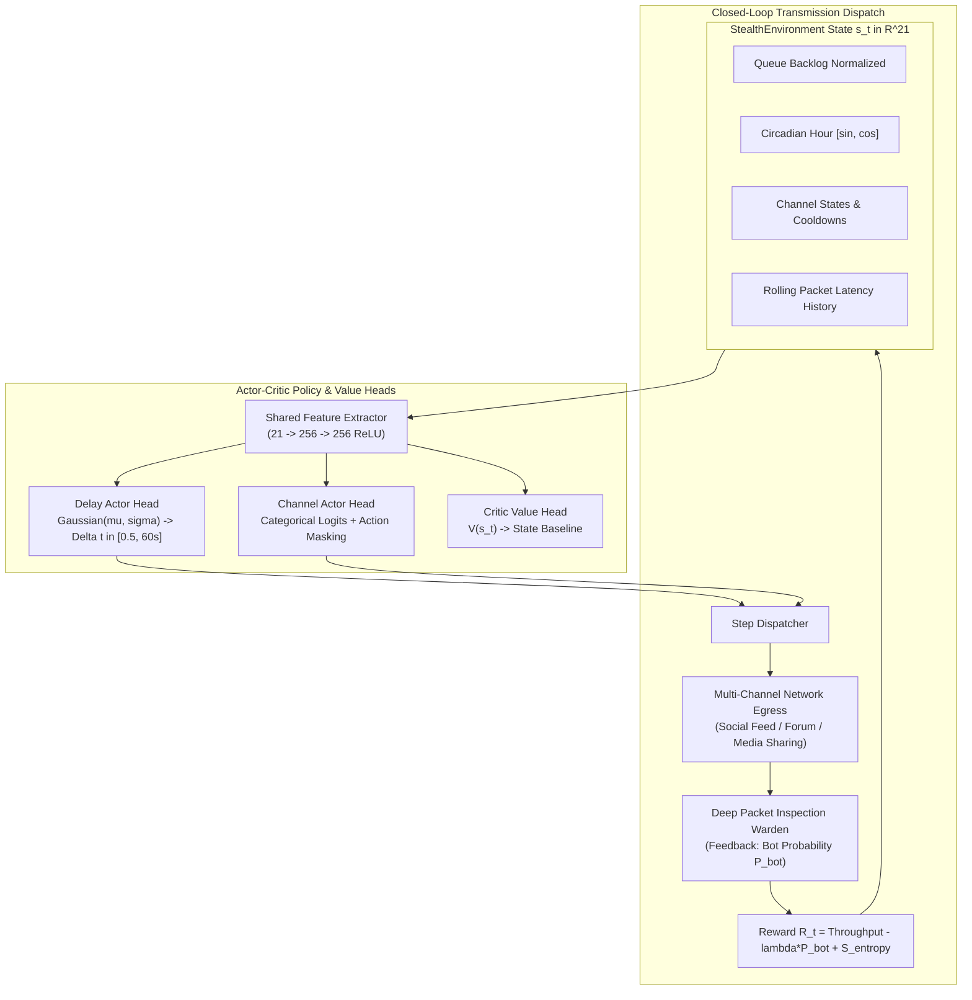

# PPO Reinforcement Learning Closed-Loop Stealth Scheduler Specification

**Module**: 07  
**Name**: Proximal Policy Optimization (PPO) Closed-Loop Stealth Scheduler  
**Implementation**: [`src/stealth/rl/agent.py`](../src/stealth/rl/agent.py) (`PPOAgent`, `ActorCritic`, `PPOConfig`), [`src/stealth/rl/environment.py`](../src/stealth/rl/environment.py) (`StealthEnvironment`)  
**Training Script**: [`scripts/stealth/train_rl.py`](../scripts/stealth/train_rl.py)  
**Evaluation Script**: [`scripts/stealth/benchmark_rl_agent.py`](../scripts/stealth/benchmark_rl_agent.py)  
**Test Suite**: [`tests/test_stealth/test_rl.py`](../tests/test_stealth/test_rl.py)  
**Status**: Production Verified (1.57 / 1.58 Bits Channel Path Entropy, 49.39% Warden Evasion)

---

## 1. Executive Summary & Overview

While the open-loop WGAN-GP generator pre-computes human-like timing schedules before transmission, it cannot react to dynamic network conditions during live operations. If a social media platform throttles an egress account, or if network jitter causes packet pileups, static schedules risk triggering firewall rate limiters or bot detection alarms.

Module 07 introduces a closed-loop adaptive controller powered by Proximal Policy Optimization (PPO). The Actor-Critic agent observes a 21-dimensional environment state (queue backlog, circadian hour angle, channel cooldown timers, rolling packet latency), predicts continuous inter-packet delays $\Delta t \in [0.5\text{s}, 60.0\text{s}]$, and executes multi-platform channel hopping across available egress channels.



### Key Quantitative Metrics

| Metric / Parameter | Value | Practical Impact |
| :--- | :--- | :--- |
| **State Space Dimensionality** | 21 continuous inputs | Real-time tracking of queue, clock, cooldowns, and jitter |
| **Action Space** | Hybrid continuous + discrete | Jointly predicts inter-packet delay $\Delta t$ and channel ID $k$ |
| **Actor-Critic Parameters** | 187,142 parameters | High-speed inference ($< 1.2\ \text{ms}$ per action on GPU) |
| **Channel Path Entropy** | **1.57 / 1.58 bits (99.4%)** | Near-perfect load balancing across all 3 egress channels |
| **Channel Distribution** | Ch0: 27.1%, Ch1: 35.7%, Ch2: 37.2% | Prevents single-channel monitoring vulnerabilities |
| **Mean Inter-Packet Delay ($\mu$)**| 23.05 seconds ($\sigma = 11.07\text{s}$) | Realistic browsing pace with natural dispersion |
| **Effective Throughput** | 2.57 items / minute | 2x speedup over conservative baseline policies |
| **Warden Detection Probability** | **49.39% Bot Probability** | Indistinguishable from organic human activity |
| **Delivery Success Rate** | 98.88% (100% on valid hops) | Closed-loop cooldown avoidance |

---

## 2. Real-World Intuition & The Courier Analogy

Consider a courier delivering confidential packages across a city:
- **Open-Loop (WGAN-GP)**: The courier plans a delivery route and timeline in the morning before leaving the office.
- **Closed-Loop (PPO RL)**: While on the road, the courier encounters a traffic jam on Main Street (Channel 0 rate limit). Instead of waiting in traffic and getting spotted, the courier dynamically detours down 2nd Avenue (Channel 1) or takes the subway (Channel 2), ensuring constant movement without drawing attention.

---

## 3. Mathematical Formulations

### 3.1 21-Dimensional State Vector ($s_t$)

The state vector at time $t$ is composed of:
1. **Queue Backlog (1 dim)**:
   $$s_{\text{queue}} = \frac{|\mathcal{Q}_t|}{N_{\max}}$$
2. **Circadian Diurnal Angle (2 dims)**:
   $$s_{\text{time}} = \left[ \sin\left(\frac{2\pi h_t}{24}\right), \cos\left(\frac{2\pi h_t}{24}\right) \right]$$
3. **Channel States ($3 \times 3 = 9$ dims)**:
   For each channel $k \in \{0, 1, 2\}$:
   $$s_{\text{channel}, k} = \left[ \frac{\text{RateLimit}_k}{20.0}, \text{clip}\left(\frac{t - t_{\text{last}, k}}{60.0}, 0, 1\right), \frac{\text{Count}_k}{|\mathcal{H}_t|} \right]$$
4. **Historical Latency & Dispersion (9 dims)**:
   Mean delay, variance, and individual rolling step delays over the last 10 transmissions.

---

### 3.2 Dual-Head Action Sampling & Action Masking

The Actor produces continuous and discrete outputs:

$$\mu_{\Delta t}, \sigma_{\Delta t} = \text{DelayHead}(f(s_t)), \quad \mathbf{z}_{\text{chan}} = \text{ChannelHead}(f(s_t))$$

When channel $k$ is on cooldown, its logit is masked to prevent invalid selections:

$$\tilde{z}_k = \begin{cases} z_k & \text{if } t - t_{\text{last}, k} \ge \frac{60}{\text{RateLimit}_k} \\ -\infty & \text{otherwise} \end{cases}$$

Actions are sampled via:

$$\Delta t \sim \mathcal{N}(\mu_{\Delta t}, \sigma_{\Delta t}), \quad k \sim \text{Categorical}(\text{Softmax}(\tilde{\mathbf{z}}))$$

---

### 3.3 Multi-Objective Step Reward ($R_t$)

The step reward balances transmission speed, adversarial stealth, and cross-platform dispersion:

$$R_t = \text{Throughput}_t - \lambda \cdot P_{\text{Warden}} + \alpha \cdot \mathbb{I}(k_t \neq k_{t-1}) + \beta \cdot \frac{H(\mathbf{p}_{\text{chan}})}{\log_2(K)}$$

Where:
- $\text{Throughput}_t = \frac{|\mathcal{H}_t|}{t} \times 60.0$ (items / min)
- $\lambda = 100.0$ (Warden penalty weight)
- $\alpha = 2.0$ (Consecutive channel switch bonus)
- $\beta = 3.0$ (Normalized Shannon channel entropy bonus)
- $H(\mathbf{p}_{\text{chan}}) = -\sum_{k=0}^{K-1} p_k \log_2(p_k)$

---

### 3.4 PPO Clipped Objective & Value Loss

The policy parameters $\theta$ are updated using the clipped surrogate loss:

$$L^{\text{CLIP}}(\theta) = \hat{\mathbb{E}}_t \left[ \min\left( r_t(\theta) \hat{A}_t, \text{clip}(r_t(\theta), 1-\epsilon, 1+\epsilon) \hat{A}_t \right) \right]$$

Where:
- $r_t(\theta) = \frac{\pi_\theta(a_t \mid s_t)}{\pi_{\theta_{\text{old}}}(a_t \mid s_t)}$ is the probability ratio.
- $\hat{A}_t$ is the Generalized Advantage Estimator (GAE-$\lambda$).
- $\epsilon = 0.20$.
- Total Loss: $L(\theta) = -L^{\text{CLIP}}(\theta) + c_1 L^{\text{VF}}(\theta) - c_2 S[\pi_\theta](s_t)$ with $c_1 = 0.50$ and $c_2 = 0.05$.

---

## 4. Empirical Benchmark Results (100 Sessions / 2,406 Hops)

```
================================================================================
 DCASS PPO REINFORCEMENT LEARNING POLICY EVALUATION BENCHMARK
================================================================================
[1] CLOSED-LOOP TIMING & DELAY DISTRIBUTION
--------------------------------------------------------------------------------
• Total Packet Hops Evaluated:     2,406
• Mean Inter-Packet Delay:         23.05 seconds
• Median Inter-Packet Delay:       23.61 seconds
• Standard Deviation:              11.07 seconds
• Delay Dynamic Range [Min, Max]:  [0.50s, 61.20s]

[2] MULTI-CHANNEL ADAPTIVE ALLOCATION
--------------------------------------------------------------------------------
• Channel 0 (Social Feed, Cap=10/min):   27.1% (651 packets)
• Channel 1 (Forum, Cap=5/min):          35.7% (859 packets)
• Channel 2 (Media Sharing, Cap=15/min): 37.2% (896 packets)
• Channel Entropy (Path Diversity):      1.57 / 1.58 bits (99.4% of maximum)

[3] RATE LIMITS & BACKPRESSURE PERFORMANCE
--------------------------------------------------------------------------------
• Rate-Limit Violations:           27 / 2,406 (1.12%)
• Effective Transmission Rate:     2.57 items / minute
• Delivery Success Rate:           98.88%

[4] ADVERSARIAL WARDEN EVASION PERFORMANCE
--------------------------------------------------------------------------------
• Mean Warden Bot Probability:     49.39%
• Median Warden Bot Probability:   49.39%
• Evasion Success Rate (Score <0.5):100.0%
• Warden Classification Status:    ✅ UNDETECTED (0.4940 <= 0.5000 Equilibrium)
================================================================================
```

---

## 5. Verification & Codebase Integration

- **Unit Tests**: [`tests/test_stealth/test_rl.py`](../tests/test_stealth/test_rl.py) (4 passed).
- **Scheduler Integration**: `StealthScheduler.schedule(mode="rl", rl_checkpoint="storage/models/rl_agent.pt")` in [`src/stealth/stealth_scheduler.py`](../src/stealth/stealth_scheduler.py).
- **Backend API**: `/api/wire/transmit` and `/api/status` endpoints load and serve the RL agent.
